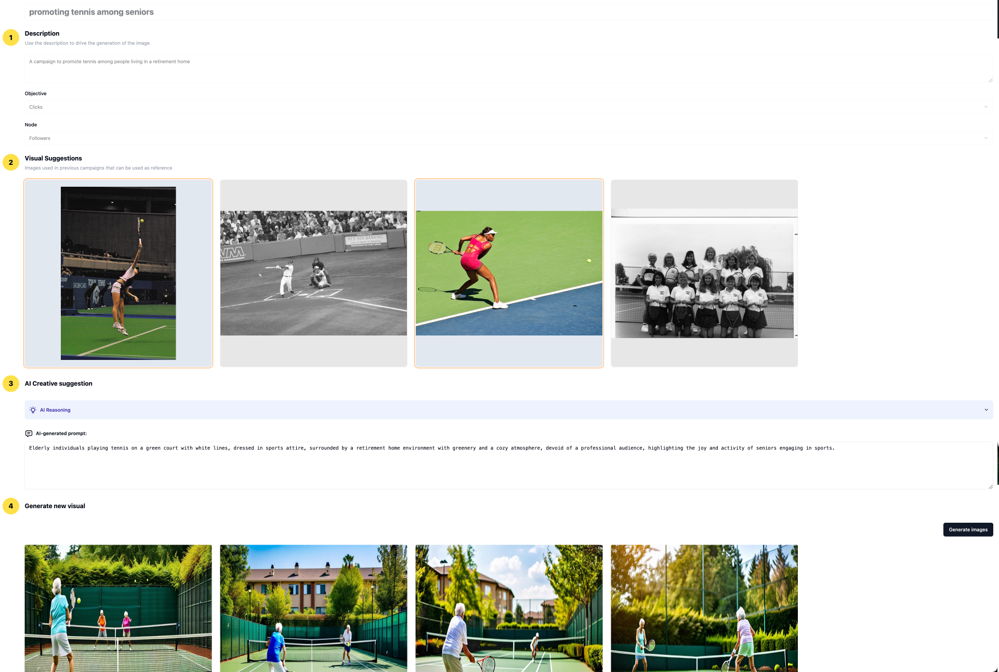
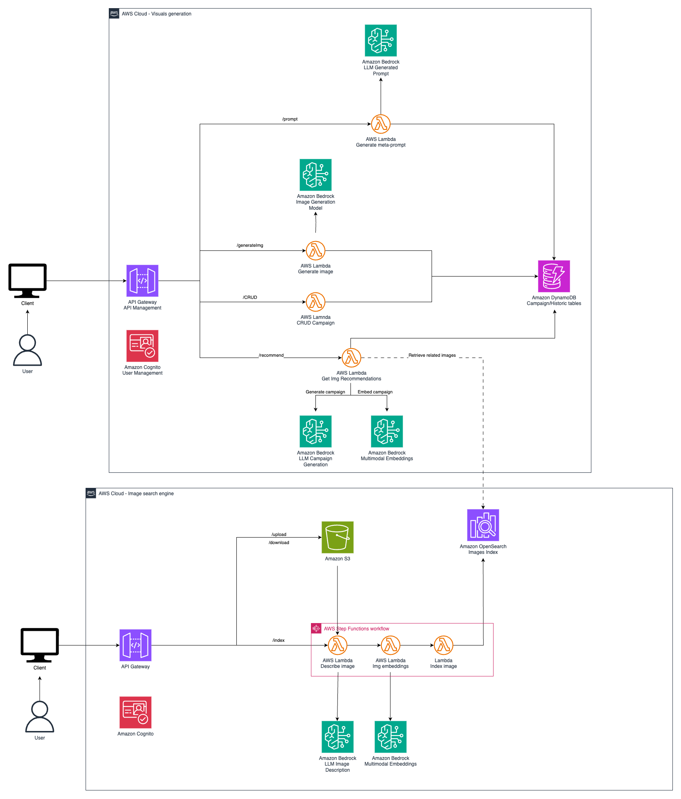

# Next generation marketing campaigns with Amazon Nova 

## Overview

This is a project to automate the **generation of marketing campaign visual assets**, leveraging Generative Artificial Intelligence (GenAI) to **create images for marketing campaigns**. You must only provide a description of the campaign to be created and the project will assist you in creating your campaign's visual assets with an easy-to-follow flow.

The project is powered by the [Amazon Nova](https://aws.amazon.com/es/ai/generative-ai/nova/) family of LLMs available on Amazon Bedrock. The models in the Nova family are used to create a prompt (Nova Pro) for generating images for marketing campaigns based on campaign description and create images (Nova Canvas) for our campaign.

This project allows creatives to quickly iterate over ideas for visuals for marketing campaigns and accelerate the creation of visual assets for any marketing campaign.

## Approach

This project helps create engaging visuals for marketing campaigns following these steps:

1. You provide a description of your campaign
2. The system automatically retrieves previous campaign images related to your current campaign, and you can select those that better represents the ideas for your new campaign
3. The system will generate a reference prompt (using Amazon Nova Pro) to generate your campaign's images using Amazon Nova Canvas. This prompt can be edited by you.
4. The system will generate up to 5 images for your campaign.

You can visualize the user interface and the steps in the following image



### Image generation

Currently, there are several text-to-image models that can assist creatives quickly iterate over ideas for visuals for marketing campaigns. [Amazon Nova Canvas](https://aws.amazon.com/es/ai/generative-ai/nova/creative/) is a state-of-the-art image generation model that creates professional-grade images from text prompts or existing images. It's designed specifically for enterprise use cases like advertising, branding, product design, and marketing workflows.

While using Amazon Nova Canvas is to generate images is straightforward a good prompt is needed in order to obtain the best possible results. We aim to democratize the use of image generation models by removing the entry barrier of having to be proficient at creating prompts by using LLMs to assist in the creation of effective prompts for image generation. This is a technique called [meta-prompting](https://cobusgreyling.medium.com/meta-prompting-a-practical-guide-to-optimising-prompts-automatically-c0a071f4b664).

### Previous images retrieval

In this project we can exploit previous campaign's images to further guide our image generation process. Using [multimodal embeddings](https://towardsdatascience.com/multimodal-embeddings-an-introduction-5dc36975966f/) and vector databases we can create a search engine to retrieve images somehow related to the campaign we are creating. Furthermore, using metadata on the past campaign's images we can retrieve those images that yielded best results according to a specific goal or KPI whether that is engagement, clicks, follows, etc.

## Architecture



This solution is made up of two components:

* The **image search engine** component is used to index previous campaign's images and their metadata. They are later used in the image generation process as reference images.
* The **visuals generation** component is used to generate the images using the flow described in [Approach](#approach).

For further details of each component please refer to their corresponding README files.

## Folder structure

This blueprint is organized as follows:

```
blueprints/genai-marketing-campaigns
|---backend-img-generation #Visuals generation component
|---backend-img-indexing #Image search engine component
|---create-opensearch-roles #Assists in the creation of Amazon OpenSearch roles 
|---frontend # UI of the application
|---readme_assets
```

## Getting started

> **Warning**
> This sample allows you to interact with models from third party providers. Your use of the third-party generative AI (GAI) models is governed by the terms provided to you by the third-party GAI model providers when you acquired your license to use them (for example, their terms of service, license agreement, acceptable use policy, and privacy policy).

> You are responsible for ensuring that your use of the third-party GAI models comply with the terms governing them, and any laws, rules, regulations, policies, or standards that apply to you.

> You are also responsible for making your own independent assessment of the third-party GAI models that you use, including their outputs and how third-party GAI model providers use any data that might be transmitted to them based on your deployment configuration. AWS does not make any representations, warranties, or guarantees regarding the third-party GAI models, which are “Third-Party Content” under your agreement with AWS. This sample is offered to you as “AWS Content” under your agreement with AWS.

To deploy this project, follow the instructions available in the README files of each of the components that make up this project. They must be deployed in the following order:

1. create-opensearch-roles: This will create the necessary roles to create an OpenSearch serverless collection
2. backend-img-indexing: This will deploy the assets required for the creation of the image search engine
3. backend-img-generation: This will deploy the assets for the visuals generation workflow
4. frontend: This will run the UI to interact with the application

**Note:** Please make sure the following models are available in your region of deployment

* Amazon Nova Canvas
* Amazon Nova Pro
* Amazon Tiitan Multimodal Embeddings

You can review the availability of models by regions in: [https://docs.aws.amazon.com/bedrock/latest/userguide/models-regions.html](https://docs.aws.amazon.com/bedrock/latest/userguide/models-regions.html)

## Security Guideline
Please see the [security guidelines](readme_assets/security.md#security).

## Content Security Legal Disclaimer
The sample code; software libraries; command line tools; proofs of concept; templates; or other related technology (including any of the foregoing that are provided by our personnel) is provided to you as AWS Content under the AWS Customer Agreement, or the relevant written agreement between you and AWS (whichever applies). You should not use this AWS Content in your production accounts, or on production or other critical data. You are responsible for testing, securing, and optimizing the AWS Content, such as sample code, as appropriate for production grade use based on your specific quality control practices and standards. Deploying AWS Content may incur AWS charges for creating or using AWS chargeable resources, such as running Amazon EC2 instances or using Amazon S3 storage.

## Operational Metrics Collection
We may collect anonymous operational metrics, including: the region a blueprint is deployed, the name and version of the blueprint deployed, and related information. We may use the metrics to maintain, provide, develop, and improve the constructs and AWS services.
