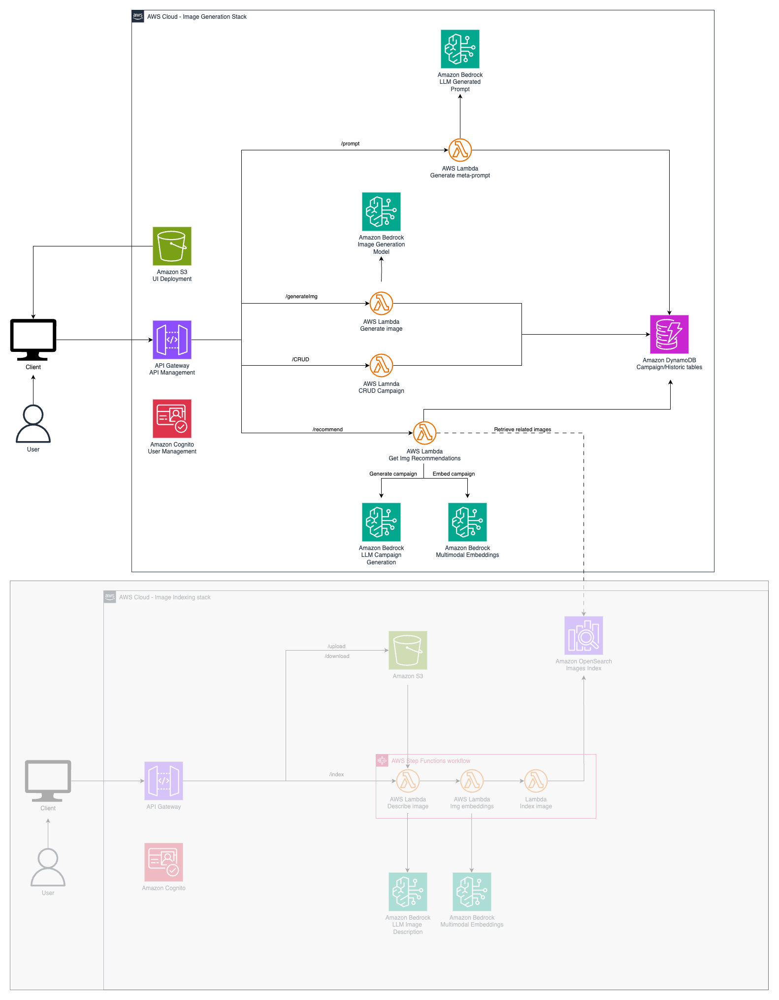

# GenAI Marketing Campaigns - Image Generation Stack

This stack will help you provision the required infrastucture to create
images for your marketing campaigns

## Pre-requisites

To successfully deploy and run this stack you must:

* Configure the AWS Credentials in your environment. Refer to [Configuration and credential file settings](https://docs.aws.amazon.com/cli/latest/userguide/cli-configure-files.html).
* Download and install AWS CLI. Refer to [Installing the AWS CLI](https://docs.aws.amazon.com/cli/latest/userguide/getting-started-install.html).
* Install and configure AWS CDK. Refer to Installing the [AWS CDK](https://docs.aws.amazon.com/cdk/v2/guide/getting_started.html). 
* Download and install Docker. Refer to [Docker](https://www.docker.com/products/docker-desktop/).
* A [bootstrapped AWS account](https://docs.aws.amazon.com/cdk/v2/guide/bootstrapping.html). 
* NodeJS >= 14.0.0 
* Python >= 3.10
* Have deployed the **OpenSearch Roles Creation**
* Have deployed the **Previous Campaigns Indexing Stack**
* Have [access](https://docs.aws.amazon.com/bedrock/latest/userguide/model-access.html) to the Amazon Nova Pro, Titan Multimodal Embeddings, and Amazon Nova Canvas models

## Setup

This project is set up like a standard Python project.  The initialization
process also creates a virtualenv within this project, stored under the `.venv`
directory.  To create the virtualenv it assumes that there is a `python3`
(or `python` for Windows) executable in your path with access to the `venv`
package. If for any reason the automatic creation of the virtualenv fails,
you can create the virtualenv manually.

To manually create a virtualenv on MacOS and Linux:

```
python3 -m venv .venv
```

After the init process completes and the virtualenv is created, you can use the following
step to activate your virtualenv.

```
source .venv/bin/activate
```

If you are a Windows platform, you would activate the virtualenv like this:

```
.venv\Scripts\activate.bat
```

Once the virtualenv is activated, you can install the required dependencies.

```
pip install -r requirements.txt
```

Since this stack pulls Docke images from the [AWS ECR Public registry](https://docs.aws.amazon.com/AmazonECR/latest/public/public-registry-auth.html) you need to log in into it.

```
aws ecr-public get-login-password --region us-east-1 | docker login --username AWS --password-stdin public.ecr.aws
```

At this point you can now synthesize the CloudFormation template for this code.

```
cdk synth
```

To add additional dependencies, for example other CDK libraries, just add
them to your `setup.py` file and rerun the `pip install -r requirements.txt`
command.

## Creation of the Image Generation Backend

Deploying this CDK stack will provision a backend that by using AWS Lambda functions 
and Amazon Bedrock will help you create stunning images for your marketing campaigns. 
The following diagram illustrates the services and infrastructure being deployed by this stack



1. [Amazon Bedrock](https://aws.amazon.com/bedrock/) is used to invoke the Amazon Nova Pro, Amazon Titan Multimodal Embeddings, and Amazon Nova Canvas models using a common API.
2. [Amazon Lambda](https://aws.amazon.com/lambda/) functions are used to create meta-prompts, generate images, retrieve related images and store the campaign in a database.
3. The campaign's information is stored in an [Amazon DynamoDB](https://aws.amazon.com/dynamodb/) database.
4. APIs are managed using [Amazon API Gateway](https://aws.amazon.com/api-gateway/).
5. [Amazon Cognito](https://aws.amazon.com/es/cognito/) is used to manage the users of the application.

To deploy this stack run

```
cdk deploy \
--parameters OSSCollectionHostParam=<<ImgIndexStack.OSSEmbeddingsIndexCollectionURLXXXXXX>> \
--parameters OSSEmbeddingsIndexNameParam=<<ImgIndexStack.EmbeddingsIndexName>> \
--parameters OSSCollectionARNParam=<<ImgIndexStack.OSSEmbeddingsIndexCollectionARNXXXXXX>> \
--parameters S3ImgsBucketParam=<<ImgIndexStack.ImagesBucketName>> \
--parameters OSSDatAccessRoleARNParam=<<CreateOpensearchRoles.DataQueryRole>>
```

**Note:** The values for the inputs in-between < > signs are user defined inputs while the ones in-between << >> come from another stack.

The most relevant outputs of the stack are:

* **ApiGatewayRestApiEndpointXXXXXX**: The URL of the API to create images for campaigns
* **CognitoIdentityPoolIdXXXXXX**: The Cognito Identity Pool Id used to authenticate the API calls
* **CognitoUserPoolClientIdXXXXXX**: The Cognito User Pool Client Application Id used to authenticate the API calls
* **CognitoUserPoolIdXXXXX**: The Cognito User Pool used to authenticate the API calls
* **RegionName**: The name of the resion where this stack is deployed

Note: The default name of this stack is: **GenAIMarketingCampaigns-ImgGenerationStack**

## Estimated costs

You are responsible for the cost of the AWS services used while running this stack.

As of August 2024, the cost for running this stack continuously for one month, with the default settings in the US East (N.Virginia) Region, and generating **1000 images** a month with a single user is approximately $67 per month.

After the stack is destroyed, you will stop incurring in costs.

The table below shows the resources provisioned by this CDK stack (prices rounded to the next dollar), and their respective cost. The table below does not take into account the free tier (where it applies).

| Service Name                                 | Description                                     | Cost (Monthly) |
|----------------------------------------------|-------------------------------------------------|----------------|
| Amazon API Gateway                           | Create and manage the API                       | $1.00          |
| Amazon Cognito                               | Create and manage the users                     | $1.00          |
| Amazon Bedrock (Nova Pro)                    | Create campaign concept                         | $1.50          |
| Amazon Bedrock (Nova Pro)                    | Create prompt from campaign description         | $1.50          |
| Amazon Bedrock (Nova Canvas)                 | Generate images from a prompt                   | $60.00         |
| Amazon Bedrock (Titan Multimodal Embeddings) | Create embeddings for the indexed images       | $1.00          |
| AWS Lambda                                   | Functions to execute the logic to create images | $1.00          |
| **Total**                                    | Monthly total assuming 1000 indexed images      | **$67.00**     |

## Create your own images

If you indexed the sports sample images provided in *../sample-data-generation* you will be able to use the application to generate campaigns for sports such as:

* snowboard 
* sports ball
* baseball bat
* baseball glove
* skateboard
* surfboard
* tennis racket

Here is an example:

**Campaign name:** Promoting tennis among seniors

**Campaign description:** A campaign to promote tennis among seniors living in a retirement home

**Objective**: Clicks

**Node**: Followers

## Clean up

If you don't want to continue using the sample, clean up its resources to avoid further charges.

Start by deleting the backend AWS CloudFormation stack which, in turn, will remove 
the underlying resources created, run the following commands:

```
cdk destroy <arguments> <options>
```

for a comprehensive list of arguments and options consult: [https://docs.aws.amazon.com/cdk/v2/guide/ref-cli-cmd-destroy.html](https://docs.aws.amazon.com/cdk/v2/guide/ref-cli-cmd-destroy.html)


