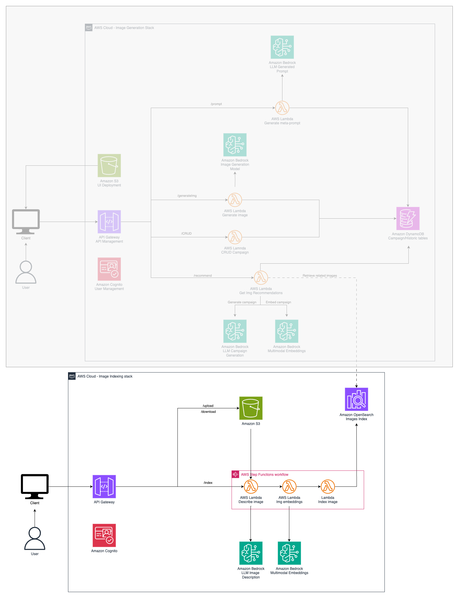

# GenAI Marketing Campaigns - Previous Campaigns Indexing Stack

This stack will help you provision the required infrastucture to index previous campaign's information into a 
search engine 

## Pre-requisites

To successfully deploy and run this stack you must:

* Configure the AWS Credentials in your environment. Refer to [Configuration and credential file settings](https://docs.aws.amazon.com/cli/latest/userguide/cli-configure-files.html).
* Download and install AWS CLI. Refer to [Installing the AWS CLI](https://docs.aws.amazon.com/cli/latest/userguide/getting-started-install.html).
* Install and configure AWS CDK. Refer to Installing the [AWS CDK](https://docs.aws.amazon.com/cdk/v2/guide/getting_started.html). 
* Download and install Docker. Refer to [Docker](https://www.docker.com/products/docker-desktop/).
* A [bootstrapped AWS account](https://docs.aws.amazon.com/cdk/v2/guide/bootstrapping.html). 
* NodeJS >= 14.0.0 
* Python >= 3.10
* Have deployed the **OpenSearch Roles Creation** stack
* Have [access](https://docs.aws.amazon.com/bedrock/latest/userguide/model-access.html) to the Amazon Nova Pro and Amazon Titan Multimodal Embeddings

## Setup

This project is set up like a standard Python project.  The initialization
process also creates a virtualenv within this project, stored under the `.venv`
directory.  To create the virtualenv it assumes that there is a `python3`
(or `python` for Windows) executable in your path with access to the `venv`
package. If for any reason the automatic creation of the virtualenv fails,
you can create the virtualenv manually.

To manually create a virtualenv on MacOS and Linux:

```
python3 -m venv .venv
```

After the init process completes and the virtualenv is created, you can use the following
step to activate your virtualenv.

```
source .venv/bin/activate
```

If you are a Windows platform, you would activate the virtualenv like this:

```
.venv\Scripts\activate.bat
```

Once the virtualenv is activated, you can install the required dependencies.

```
pip install -r requirements.txt
```

Since this stack pulls Docke images from the [AWS ECR Public registry](https://docs.aws.amazon.com/AmazonECR/latest/public/public-registry-auth.html) you need to log in into it.

```
aws ecr-public get-login-password --region us-east-1 | docker login --username AWS --password-stdin public.ecr.aws
```

At this point you can now synthesize the CloudFormation template for this code.

```
cdk synth
```

To add additional dependencies, for example other CDK libraries, just add
them to your `setup.py` file and rerun the `pip install -r requirements.txt`
command.

## Creation of the Campaign's Indexing Backend

Deploying this CDK stack will provision an OpenSearch serverless index to hold the information about previous 
marketing campaigns. This OpenSearch index is used as a search engine for obtaining campaigns similar to the one
being generated that worked in the past. The following diagram illustrates the services and infrastructure being 
deployed by this stack



1. An [Amazon OpenSearch Serverless](https://aws.amazon.com/opensearch-service/features/serverless/) index is created to store the information of previous campaign's.
2. [AWS Step Functions](https://aws.amazon.com/step-functions/) is used to orchestrate the campaign's processing workflow.
3. [Amazon Lambda](https://aws.amazon.com/lambda/) functions are used to process the images being indexed.
4. The image is described and key elements are identified using **Amazon Nova Pro** model on [Amazon Bedrock](https://aws.amazon.com/bedrock).
5. The image is transformed into embeddings using the [Titan Multimodal Embeddings](https://docs.aws.amazon.com/bedrock/latest/userguide/titan-multiemb-models.html) foundation model (FM) available through [Amazon Bedrock](https://aws.amazon.com/bedrock).
6. APIs are managed using [Amazon API Gateway](https://aws.amazon.com/api-gateway/).
7. [Amazon Cognito](https://aws.amazon.com/es/cognito/) is used to manage the users of the application.

To deploy this stack run

```
cdk deploy \
--parameters OSSCollectionName=<Name of the OpenSearch Serverless collection to create> \
--parameters OSSEmbeddingsIndexName=<Name of the OpenSearch Serverless index to create> \
--parameters OSSDataIndexingRoleARNParam=<<CreateOpenSearchRoles.DataIndexingRole>> \
--parameters OSSDataQueryRoleARNParam=<<CreateOpenSearchRoles.DataQueryRole>>
```

**Note:** The values for the inputs in-between < > signs are user defined inputs while the ones in-between << >> come from another stack.

The most relevant outputs of the stack are:

* **IndexImgAPIApiGatewayRestApiEndpointXXXXXX**: The URL of the API to index images
* **IndexImgAPICognitoIdentityPoolIdXXXXXX**: The Cognito Identity Pool Id used to authenticate the API calls
* **IndexImgAPICognitoUserPoolClientIdXXXXXX**: The Cognito User Pool Client Application Id used to authenticate the API calls
* **IndexImgAPICognitoUserPoolIdXXXXX**: The Cognito User Pool used to authenticate the API calls
* **OSSEmbeddingsIndexCollectionURLXXXXXX**: The OpenSearch Serverless Collection used to store the data of the images being indexed
* **OSSEmbeddingsIndexCollectionARNXXXXXX**: The ARN of the OpenSearch Serverless Collection used to store the data of the images being indexed
* **EmbeddingsIndexName**: The name of the created OpenSearch serverless index
* **ImagesBucketName**: The bucket where the indexed images will be stored

The default name of this stack is: **GenAIMarketingCampaigns-ImgIndexStack**

## Index your images

In this section you will learn how to use the created API to index your own images.

### Create cognito users

First you need to create a Cognito user to authenticate your API requests. The user pool's name deployed by this stack is within **IndexImgAPICognitoUserPoolIdXXXXX**.
Follow the instructions on [https://docs.aws.amazon.com/cognito/latest/developerguide/managing-users.html](https://docs.aws.amazon.com/cognito/latest/developerguide/managing-users.html)

### Getting authentication tokens for the API

At a command shell already configured for the account where the resources are being deployed, run the following to initiate cognito authentication:

```
aws cognito-idp initiate-auth --auth-flow USER_PASSWORD_AUTH \
--client-id <IndexImgAPICognitoUserPoolClientIdXXXXXX> \
--auth-parameters USERNAME=<USER>,PASSWORD=<PASSWORD>
```

If it’s the first time authenticating, you are required to change password and will get a response like this:

```
{
    "ChallengeName": "NEW_PASSWORD_REQUIRED",
    "Session": "<SESSION_TOKEN>", "ChallengeParameters": {
        "USER_ID_FOR_SRP": "<USER>",
        "requiredAttributes": "[]",
        "userAttributes": "{
            \"email_verified\":\"true\",
            \"email\":\"<USER>@amazon.com\"
        }"
    }
}
```

To change password in response to the previous item type

```
aws cognito-idp respond-to-auth-challenge \
--client-id <IndexImgAPICognitoUserPoolClientIdXXXXXX> \
--challenge-name NEW_PASSWORD_REQUIRED \
--challenge-responses USERNAME=<USER>,NEW_PASSWORD=<PASSWORD> \
--session "<SESSION_TOKEN>"
```

Once authenticated, you’ll get a response like this

```
{
    "ChallengeParameters": {},
    "AuthenticationResult": {
        "AccessToken": "<ACCESS_TOKEN>",
        "ExpiresIn": 3600,
        "TokenType": "Bearer",
        "RefreshToken": "<REFRESH_TOKEN>",
        "IdToken": "<ID_TOKEN>",
    }
}
```

The token needed to authenticate the API is **<ID_TOKEN>** 

### Use the API to index your images

Use the API to index your images. The API exposes the following methods

| Method                                     | Method Type |
|--------------------------------------------|-------------|
| imgMetaIndex/download/{folder}/{imageFile} | GET         |
| imgMetaIndex/indexImage                    | POST        |
| imgMetaIndex/upload/{folder}/{key}         | PUT         |

the full definition of the API can be found in the file *api_definition.json*

### (Optional) Index the sample images

You can opt to index some sample images. Please navigate to *../sample-data-generation* folder for instructions on how to index sample images.

## Estimated costs

You are responsible for the cost of the AWS services used while running this stack.

As of April 2025, the cost for running this stack continuously for one month, with the default settings in the US East (N.Virginia) Region, and processing (indexing) **1000 images** a month with a single user is approximately $360 per month.

After the stack is destroyed, you will stop incurring in costs.

The table below shows the resources provisioned by this CDK stack (prices rounded to the next dollar), and their respective cost. The table below does not take into account the free tier (where it applies).

| Service Name                                 | Description                                    | Cost (Monthly) |
|----------------------------------------------|------------------------------------------------|----------------|
| Amazon API Gateway                           | Create and manage the API                      | $1.00          |
| Amazon Cognito                               | Create and manage the users                    | $1.00          |
| Amazon S3                                    | Store the indexed images                       | $1.00          |
| Amazon Bedrock (Nova Pro)                    | Describe the image                             | $4.00          |
| Amazon Bedrock (Titan Multimodal Embeddings) | Create embeddings for the indexed images       | $1.00          |
| AWS Step Functions                           | Workflow to index images                       | $1.00          |
| AWS Lambda                                   | Functions to execute the logic to index images | $1.00          |
| Amazon OpenSearch Serverless                 | Store and search embeddings of indexed images  | $350.00        |
| **Total**                                    | Monthly total assuming 1000 indexed images     | **$360.00**    |

## Clean up

If you don't want to continue using the sample, clean up its resources to avoid further charges.

Start by deleting the backend AWS CloudFormation stack which, in turn, will remove 
the underlying resources created, run the following commands:

```
cdk destroy <arguments> <options>
```

for a comprehensive list of arguments and options consult: [https://docs.aws.amazon.com/cdk/v2/guide/ref-cli-cmd-destroy.html](https://docs.aws.amazon.com/cdk/v2/guide/ref-cli-cmd-destroy.html)

