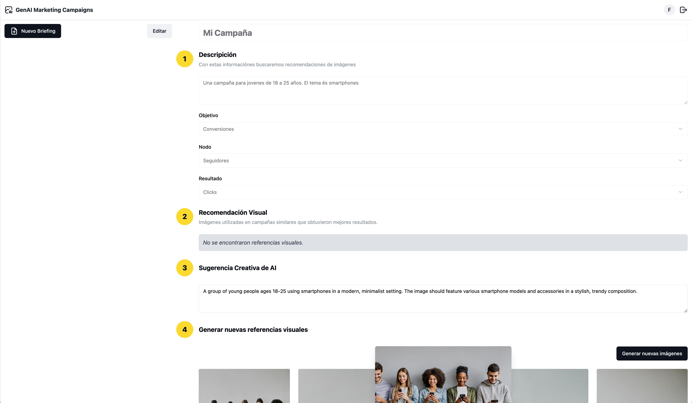

# GenAI Marketing Campaign Assistant

This repository contains a web application (frontend) for the GenAI-based marketing campaign creation assistance use-case.

It was built with [Vite](https://vitejs.dev/) + [React](https://react.dev/). For security reasons we do not provide a deployment stack, but you can run it locally.

The UI has a wizard-like interface for step-by-step campaign creation and help you with meta-prompting and will look like the one bellow.



Just read the instructions for each step and wait for the results. At the end the application will generate a few images that could potentially be used as inspiration for a complete campaign briefing.

## Requirements

In order to run this project, you need to have installed:

- Node >= 18.x.x

You also need to have the proper backend stack for your prototype deployed into your account, as well as a valid user configured in [Amazon Cognito](https://aws.amazon.com/cognito/).

---

## Developing and running locally

### Configuring your environment

In a terminal, run:

```shell
$ cd webapp/
```

Inside the `webapp/` folder, create a file named `.env`. Copy the environment displayed below and replace the property values with the outputs from your deployed backend stack.

```properties
VITE_AWS_REGION="<<ImgGenerationStack.RegionName>>"
VITE_COGNITO_USER_POOL_ID="<<ImgGenerationStack.CognitoUserPoolIdXXXXX>>"
VITE_COGNITO_USER_POOL_CLIENT_ID="<<ImgGenerationStack.CognitoUserPoolClientIdXXXXXX>>"
VITE_COGNITO_IDENTITY_POOL_ID="<<ImgGenerationStack.CognitoIdentityPoolIdXXXXXX>>"
VITE_API_GATEWAY_REST_API_ENDPOINT="<<ImgGenerationStack.ApiGatewayRestApiEndpointXXXXXX>>"
VITE_API_NAME="<API_NAME>"
VITE_APP_NAME="<APP_NAME>"
```

**Note:** The values for the inputs in-between < > signs are user defined inputs while the ones in-between << >> come from another stack.

### Developing with dev mode

From the `webapp/` folder, you can run the following command in a terminal to run the app in development mode:

```shell
$ npm i
$ npm run dev
```

Open [http://localhost:5173/](http://localhost:5173/) to view it in your browser.

The page will reload when you make changes. You may also see any lint errors in the console.

### Developing with watch and hot reloading

In one terminal window, run:

```shell
$ npm run watch
```

In another window, run:

```shell
$ npm run preview
```

This template provides a minimal setup to get React working in Vite with HMR and some ESLint rules. It builds the app for production to the `dist` folder. It correctly bundles React in production mode and optimizes the build for the best performance.

## Create your own images

If you indexed the sports sample images provided in *../sample-data-generation* you will be able to use the application to generate campaigns for sports such as:

* snowboard 
* sports ball
* baseball bat
* baseball glove
* skateboard
* surfboard
* tennis racket

Here is an example:

**Campaign name:** Promoting tennis among seniors

**Campaign description:** A campaign to promote tennis among seniors living in a retirement home

**Objective**: Clicks

**Node**: Followers

---