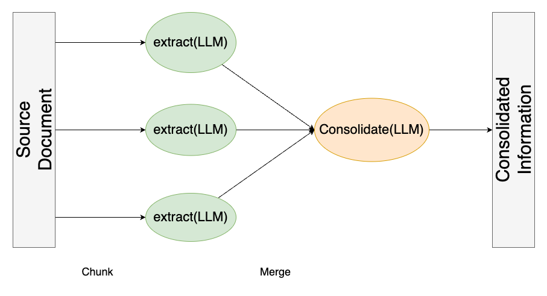
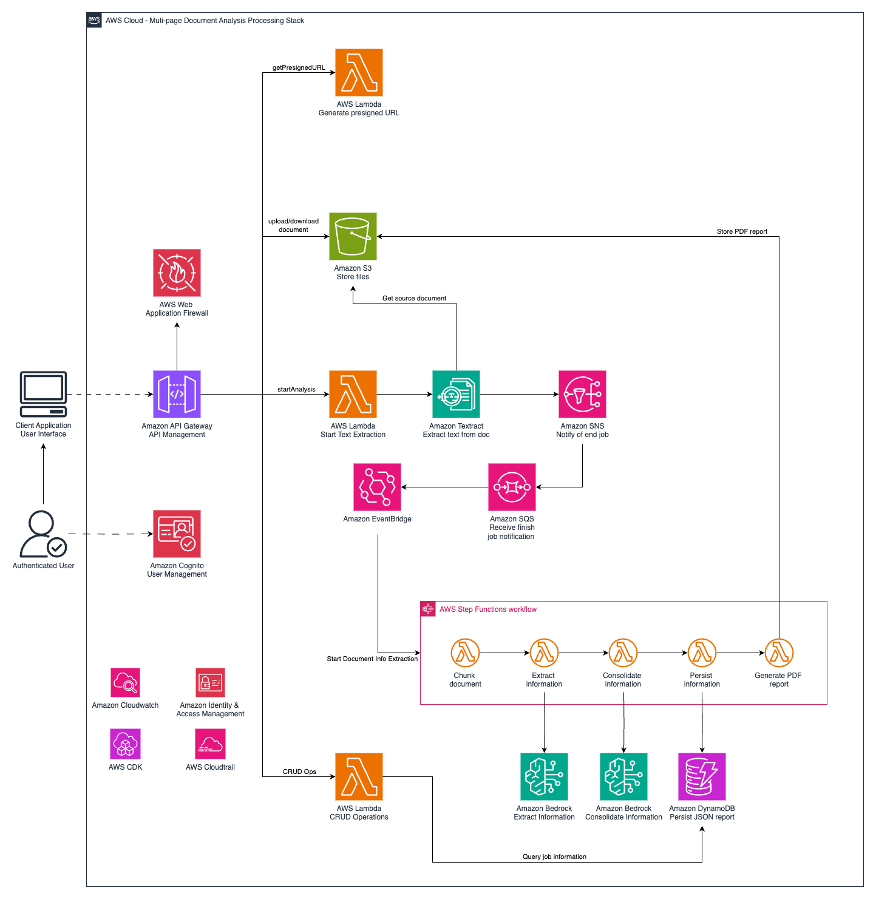

# Multi-page document analysis with generative AI

## Overview

This is a project to automate the **analysis of arbitrarily large PDF documents**, leveraging Generative Artificial Intelligence (GenAI) to extract **user defined information** from the source document and consolidate it in a JSON object that can be processed by other systems. Additionally, a PDF report is generated for the consolidated information.

The project is powered by Large Language Models (LLM) available on Amazon Bedrock, capable of extracting information from text. LLMs are used to perform advanced natural language tasks, such as information extraction and information consolidation based on user-defined sections.

This project addressed the need to process documents that far exceed the context window of most modern LLMs with high accuracy and being cost-efficient. You can customize the project to extract any kind of information from PDF documents.

## Approach

To overcome the limit on context-window of LLMs we designed a [map-reduce](https://en.wikipedia.org/wiki/MapReduce) like technique to extract information, using an LLM, from chunks of the document smaller than the context-window of the LLM (the map step) and then consolidate the multiple instances of the extracted information into a single instance containing all the extracted information (the reduce step). This approach allows us to process arbitrarily long documents. Furthermore, by processing smaller chunks we can avoid hallucinations associated with long context-windows (see [RULER: What's the Real Context Size of Your Long-Context Language Models?](https://arxiv.org/abs/2404.06654)), thus achieving more accurate results.



## Architecture



The core of this solution is the document processing workflow, which leverages the Anthropic's Claude 3 LLM family to perform advanced natural language tasks to extract information from every chunk and then consolidate it in a single JSON object. Additionally, there are components for the user interface, comprising web application hosting, authentication, and integration services.

## Folder structure

This blueprint is organized as follows:

```
blueprints/multipage-document-analysis
|---backend
|---frontend      # UI of the application
|---readme_assets
```

## Getting started

> **Warning**
> This sample allows you to interact with models from third party providers. Your use of the third-party generative AI (GAI) models is governed by the terms provided to you by the third-party GAI model providers when you acquired your license to use them (for example, their terms of service, license agreement, acceptable use policy, and privacy policy).

> You are responsible for ensuring that your use of the third-party GAI models comply with the terms governing them, and any laws, rules, regulations, policies, or standards that apply to you.

> You are also responsible for making your own independent assessment of the third-party GAI models that you use, including their outputs and how third-party GAI model providers use any data that might be transmitted to them based on your deployment configuration. AWS does not make any representations, warranties, or guarantees regarding the third-party GAI models, which are “Third-Party Content” under your agreement with AWS. This sample is offered to you as “AWS Content” under your agreement with AWS.

To deploy this project, follow the instructions available in the README files located at the **backend** and **frontend** folders, in that sequence.


## Content Security Legal Disclaimer
The sample code; software libraries; command line tools; proofs of concept; templates; or other related technology (including any of the foregoing that are provided by our personnel) is provided to you as AWS Content under the AWS Customer Agreement, or the relevant written agreement between you and AWS (whichever applies). You should not use this AWS Content in your production accounts, or on production or other critical data. You are responsible for testing, securing, and optimizing the AWS Content, such as sample code, as appropriate for production grade use based on your specific quality control practices and standards. Deploying AWS Content may incur AWS charges for creating or using AWS chargeable resources, such as running Amazon EC2 instances or using Amazon S3 storage.

## Operational Metrics Collection
We may collect anonymous operational metrics, including: the region a blueprint is deployed, the name and version of the blueprint deployed, and related information. We may use the metrics to maintain, provide, develop, and improve the constructs and AWS services.
