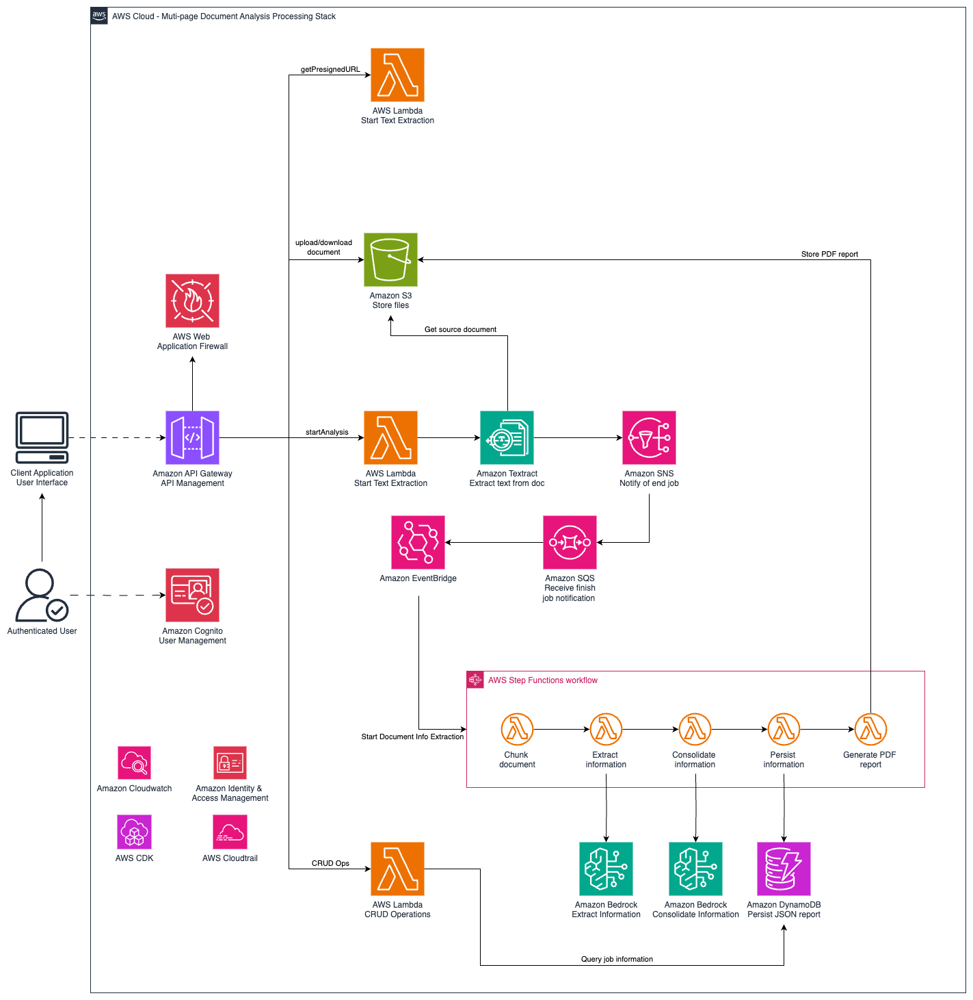

# Multipage document analysis with Generative AI - Backend CDK Stack

This stack will help you provision the required infrastucture to analyse complex multi-page documents.

## Pre-requisites

To successfully deploy and run this stack you must:

* Download and install [NodeJS](https://nodejs.org/en) >= 14.0.0 
* Download and install [Python](https://www.python.org/downloads/release/python-3100/) >= 3.10
* Download and install Docker. Refer to [Docker](https://www.docker.com/products/docker-desktop/).
* Download and install AWS CLI. Refer to [Installing the AWS CLI](https://docs.aws.amazon.com/cli/latest/userguide/getting-started-install.html).
* Install and configure AWS CDK. Refer to Installing the [AWS CDK](https://docs.aws.amazon.com/cdk/v2/guide/getting_started.html). 
* Configure the AWS Credentials in your environment. Refer to [Configuration and credential file settings](https://docs.aws.amazon.com/cli/latest/userguide/cli-configure-files.html).
* A [bootstrapped AWS account](https://docs.aws.amazon.com/cdk/v2/guide/bootstrapping.html). 
* Have [access](https://docs.aws.amazon.com/bedrock/latest/userguide/model-access.html) to Anthropic's Claude 3 Haiku and Claude 3.5 Sonnet V1 models

## Setup

This project is set up like a standard Python project.  The initialization
process also creates a virtualenv within this project, stored under the `.venv`
directory.  To create the virtualenv it assumes that there is a `python3`
(or `python` for Windows) executable in your path with access to the `venv`
package. If for any reason the automatic creation of the virtualenv fails,
you can create the virtualenv manually.

Before proceeding with the following instructions, please make sure you are inside the folder: 
*multipage-document-analys/backend*

Create a virtualenv on MacOS and Linux:

```
python3 -m venv .venv
```

After the init process completes and the virtualenv is created, you can use the following
step to activate your virtualenv.

```
source .venv/bin/activate
```

If you are a Windows platform, you would activate the virtualenv like this:

```
.venv\Scripts\activate.bat
```

Once the virtualenv is activated, you can install the required dependencies.

```
pip install -r requirements.txt
```

Since this stack pulls Docker images from the [AWS ECR Public registry](https://docs.aws.amazon.com/AmazonECR/latest/public/public-registry-auth.html) you need to log in into it.

```
aws ecr-public get-login-password --region us-east-1 | docker login --username AWS --password-stdin public.ecr.aws
```

Note:  If you are on Windows and you received the following error: ``` Error saving credentials: error storing credentials - err: exit status 1, out: The stub received bad data. ``` Check the following workaround: https://stackoverflow.com/questions/60807697/docker-login-error-storing-credentials-the-stub-received-bad-data

At this point you can now synthesize the CloudFormation template for this code.

```
cdk synth
```

To add additional dependencies, for example other CDK libraries, just add
them to your `setup.py` file and rerun the `pip install -r requirements.txt`
command.

## (Optional) Bootstrap your account
Bootstrapping prepares your AWS environment by provisioning specific AWS resources in your environment that are used by the AWS CDK. These resources are commonly referred to as your bootstrap resources. For more information go to the following AWS link: [AWS CDK bootstratpping](https://docs.aws.amazon.com/cdk/v2/guide/bootstrapping.html)

To bootstrap your account run the following command: 

```
cdk bootstrap
```
Note: This step is only required if your AWS account has not bootstrapped for CDK yet. 


## Creation of the document processing backend

Deploying this CDK stack will provision a backend that by using AWS Lambda functions 
and Amazon Bedrock will help you process arbitrarily large multi-page documents to extract arbitrary (user defined) data from the source document. 
The following diagram illustrates the services and infrastructure deployed by this stack.



1. [Amazon Textract](https://aws.amazon.com/textract/) is used to invoke the asynchronously extract the text from PDF source documents. 
2. An [Amazon SNS](https://aws.amazon.com/sns/) topic is notified when the text extraction process is finished. 
3. An [Amazon SQS](https://aws.amazon.com/sqs/) queue subscribed to the SNS topic receives the notification that the text has been extracted from the PDF source document .
4. [Amazon EventBridge](https://aws.amazon.com/eventbridge/) is used to trigger the document processing workflow as soon as the text has been extracted from the source document.
5. [AWS Step Functions](https://aws.amazon.com/step-functions/) is used to orchestrate the document's processing workflow.
6. [Amazon Lambda](https://aws.amazon.com/lambda/) functions are used to create chunk the source document, extract information from the source document, persist the results to a database and generate the PDF results file.
7. [Amazon Bedrock](https://aws.amazon.com/bedrock/) is used to invoke the Anthropic's Claude 3 models using a simple API. 
8. The processing workflow status and results are stored in an [Amazon DynamoDB](https://aws.amazon.com/dynamodb/) table. 
9. APIs are managed using [Amazon API Gateway](https://aws.amazon.com/api-gateway/). 
10. Source documents and results documents are stored in an [Amazon S3](https://aws.amazon.com/s3/) bucket.
11. [Amazon Cognito](https://aws.amazon.com/es/cognito/) is used to manage the users of the application.
12. [AWS WAF](https://aws.amazon.com/waf/) protect the API from security exploits.

To deploy this stack run

```
cdk deploy \
--parameters LanguageCode=[es|en] \
--parameters IncludeExamples=[true|false] \
--parameters PagesChunk=<Number of pages per chunk> \
--parameters ExtractionConfidenceLevel=<Threshold (0-99) for filtering extractions by the model>
```
| Parameter Name                                                   | Description                               
|-------------------------------------------------------------|-----------------------------------------|
| LanguageCode| The language of the input document being processed and desired language for output results
| IncludeExamples| Toggle between zero-shot learning (false) and few-shot learning (true) for information extraction |
| PagesChunk| Number of desired pages per document chunk  | 
| ExtractionConfidenceLevel|This parameter sets the minimum confidence score that extracted data must meet to be included in further processing steps. We use an [LLM-as-a-judge](https://www.evidentlyai.com/llm-guide/llm-as-a-judge) to evaluate the accuracy and completeness of the extracted information. Set a value between 0 and 99.|

Note: We carried out our experiments using a PagesChunk of 5 and an ExtractionConfidenceLevel of 85.

The most relevant outputs of the stack are:

* **ApiGatewayRestApiEndpointXXXXXX**: The URL of the API to process documents and obtain results
* **CognitoIdentityPoolIdXXXXXX**: The Cognito Identity Pool Id used to authenticate the API calls
* **CognitoUserPoolClientIdXXXXXX**: The Cognito User Pool Client Application Id used to authenticate the API calls
* **CognitoUserPoolIdXXXXX**: The Cognito User Pool used to authenticate the API calls
* **RegionName**: The name of the region where this stack is deployed

Note: The default name of this stack is: **Stack-MultipageDocumentAnalysis**

## Estimated costs

You are responsible for the cost of the AWS services used while running this stack.

### Assumptions:

* Each page of the document has around 500 tokens.
* Each document is 100 pages long.
* The number of extracted sections is 5.
* The number of output tokens per extraction is 1000 tokens.

As of August 2024, the monthly cost for running this stack with the default settings (no examples for information extraction) in the US East (N.Virginia) Region, and processing **1000 documents** with a single user is approximately \$1273 USD per month. That is $1.3 USD per **100 page** processed document approximately. 

After the stack is destroyed, you will stop incurring in costs.

The table below shows the resources provisioned by this CDK stack (prices rounded to the next dollar), and their respective cost. The table below does not take into account the free tier (where it applies).

| Service Name                       | Description                                             | Cost (Monthly) |
|------------------------------------|---------------------------------------------------------|----------------|
| Amazon Textract                    | Extract text from PDF                                   | $150           |
| Amazon Bedrock (Claude 3 Haiku)    | Extract information per chunk                           | $938           |
| Amazon Bedrock (Claude 3.5 Sonnet) | Consolidate information per section                     | $150           |
| Amazon S3                          | Store source and results documents                      | $1             |
| Amazon API Gateway                 | Create and manage the API                               | $18.00         |
| Amazon Cognito                     | Create and manage the users                             | $1.00          |
| AWS Lambda                         | Functions to execute the logic to process the documents | $10.00         |
| AWS Step Functions                 | Orchestrate Lambda functions                            | $1.00          |
| Amazon SQS                         | Receive notifications from Textract                     | $1.00          |
| Amazon SNS                         | Receive notifications from Textract                     | $1.00          |
| Amazon EventBridge                 | Trigger Step Functions workflow on Textract completion  | $1.00          |
| Amazon DynamoDB                    | Store process status and results                        | $1.00          |
| **Total**                          | Monthly total assuming 1000 processed documents         | **$1273.00**   |

**Note**: The use of examples for few shot prompting will increase the Bedrock (Claude 3.5 Haiku) costs according to the total number of tokens in the examples.

## [Optional] Specify the information to be extracted from the source document

You can specify what information to be extracted from each document. Navigate to *pace_backend/text_analysis_workflow/shared*

```
pace_backend/text_analysis_workflow/shared
|
|---CharterReports.py
|---section_definition.py
```

1. Create a file to hold the information of what is to be extracted and name it *InformationExtraction.py*. You can follow the example defined in *CharterReports.py*.
2. Within *InformationExtraction.py* define what information is to be extracted using [Pydantic](https://docs.pydantic.dev/latest/) objects
   1. Besides the definition of the objects each object must implement a *to_tuples_table(self)* method that will speficy how to map this object to a set of tuples that can be printed to a PDF file using the [fpdf2](https://py-pdf.github.io/fpdf2/) pyhton library.
3. Within *section_definition.py* import all the sections defined in *InformationExtraction.py* you want to extract from the source document.
4. Within *section_definition.py* modify the *report_sections* list to define the names of the sections to be extracted from your source document.
5. Within *section_definition.py* modify the *info_to_output_mapping* dictionary to map each section name to a Pydantic object.

## [Optional] Add examples to increase accuracy of your results

This approach supports examples to incorporate in the information extraction process (see [few shot prompting](https://www.promptingguide.ai/techniques/fewshot)). The default deploy configuration for this stack ignores the use of examples, should you opt to use examples you must create and store them in: *pace_backend/text_analysis_workflow/extract_data_to_schema_fn/prompt_selector/examples/{language_code}* where <language_code> should match the <LanguageCode> input parameter of the stack.

Here are the current contents of the *examples/es* folder:

```
pace_backend/text_analysis_workflow/extract_data_to_schema_fn/prompt_selector/examples/es
|
|---administration
    |
    |---example_chunk_{i}.json
    |---example_chunk_{i}.txt
|---general_information
|---legal_representative
|---notary_information
|---shareholders
```

Note that each folder within *examples/es* is named after the sections defined in the file *pace_backend/text_analysis_workflow/shared/section_definition.py* (see [Specify the information to be extracted from the source document](#optional-specify-the-information-to-be-extracted-from-the-source-document)) we will refer to this as section folders.

For each section folder you can add N examples. An example is made up of a pair of files. For the i-th example you should create:

```
example_chunk_{i}.json
example_chunk_{i}.txt
```

* *example_chunk_{i}.json*: holds the extracted information for the i-th example as a JSON object. **The extraction must be consistent with the information defined in** *pace_backend/text_analysis_workflow/shared/InformationExtraction.py* (see [Specify the information to be extracted from the source document](#optional-specify-the-information-to-be-extracted-from-the-source-document))
* *example_chunk_{i}.txt*: the raw text for the i-th example from which the information is extracted

You may use the demo examples as a guide for you to create your own examples.

**Note:** Consider that adding examples will increase the costs of the information extraction step according to the number of tokens per examples. Also, latency may increase. 

## [Optional] Invoke the exposed API directly

Although this sample is shipped with a demo UI (see the *frontend* folder) you can also process your documents invoking the API exposed directly. The API is authenticated using [Amazon Cognito Identity Pools](https://docs.aws.amazon.com/cognito/latest/developerguide/cognito-identity.html) using an **authetication token**. To generate the authentication token follow these instructions:

### Create cognito users

First you need to create a Cognito user to authenticate your API requests. The user pool's name deployed by this stack is within **DocumentsApiCognitoUserPoolClientIdXXXXX**.
Follow the instructions on [https://docs.aws.amazon.com/cognito/latest/developerguide/managing-users.html](https://docs.aws.amazon.com/cognito/latest/developerguide/managing-users.html)

**Note:** The values for the inputs in-between < > signs are user defined inputs while the ones in-between << >> are part of this stack's outputs.

### Getting authentication tokens for the API

At a command shell already configured for the account where the resources are being deployed, run the following to initiate cognito authentication:

```
aws cognito-idp initiate-auth --auth-flow USER_PASSWORD_AUTH \
--client-id <<DocumentsApiCognitoUserPoolClientIdXXXXX>> \
--auth-parameters USERNAME=<USER>,PASSWORD=<PASSWORD>
```

If it’s the first time authenticating, you are required to change password and will get a response like this:

```
{
    "ChallengeName": "NEW_PASSWORD_REQUIRED",
    "Session": "<<SESSION_TOKEN>>", "ChallengeParameters": {
        "USER_ID_FOR_SRP": "<<USER>>",
        "requiredAttributes": "[]",
        "userAttributes": "{
            \"email_verified\":\"true\",
            \"email\":\"<<USER>>@amazon.com\"
        }"
    }
}
```

To change password in response to the previous item type

```
aws cognito-idp respond-to-auth-challenge \
--client-id <<DocumentsApiCognitoUserPoolClientIdXXXXX>> \
--challenge-name NEW_PASSWORD_REQUIRED \
--challenge-responses USERNAME=<USER>,NEW_PASSWORD=<PASSWORD> \
--session "<<SESSION_TOKEN>>"
```

Once authenticated, you’ll get a response like this

```
{
    "ChallengeParameters": {},
    "AuthenticationResult": {
        "AccessToken": "<<ACCESS_TOKEN>>",
        "ExpiresIn": 3600,
        "TokenType": "Bearer",
        "RefreshToken": "<<REFRESH_TOKEN>>",
        "IdToken": "<<ID_TOKEN>>",
    }
}
```

The token needed to authenticate the API is **<<ID_TOKEN>>** 

### Use the API to process your documents

The API exposes the following methods

| Method                                                         | Method Type | Description                                             |
|----------------------------------------------------------------|-------------|---------------------------------------------------------|
| multipage-doc-analysis/download/{docType}/{folder}/{imageFile} | GET         | Get an S3 presigned URL to download a file              |
| multipage-doc-analysis/upload/{folder}/{key}                   | PUT         | Get an S3 presigned URL to upload a file                |
| multipage-doc-analysis/jobs/query                              | GET         | Get the status of all jobs                              |
| multipage-doc-analysis/jobs/query/{id}                         | GET         | Get the details of job with {id}                        |
| multipage-doc-analysis/jobs/results/{id}                       | GET         | Get the extracted information as JSON for job with {id} |
| multipage-doc-analysis/processDocument                         | POST        | Start the processing of a document                      |

the full definition of the API can be found in the file [readme_assets/api-definition-swagger.json](readme_assets/api-definition-swagger.json). API requests with [Insomina](https://insomnia.rest/) can be found in [readme_assets/api_invocations_insomnia.json](readme_assets/api-invocations-insomnia.json).

You can find a sample charter report (in spanish) file in [sample_files/acta_constitutiva.pdf](sample_files/acta_constitutiva.pdf)

## Clean up

If you don't want to continue using the sample, clean up its resources to avoid further charges.

Start by deleting the backend AWS CloudFormation stack which, in turn, will remove 
the underlying resources created, run the following commands:

```
cdk destroy <arguments> <options>
```

for a comprehensive list of arguments and options consult: [https://docs.aws.amazon.com/cdk/v2/guide/ref-cli-cmd-destroy.html](https://docs.aws.amazon.com/cdk/v2/guide/ref-cli-cmd-destroy.html)


