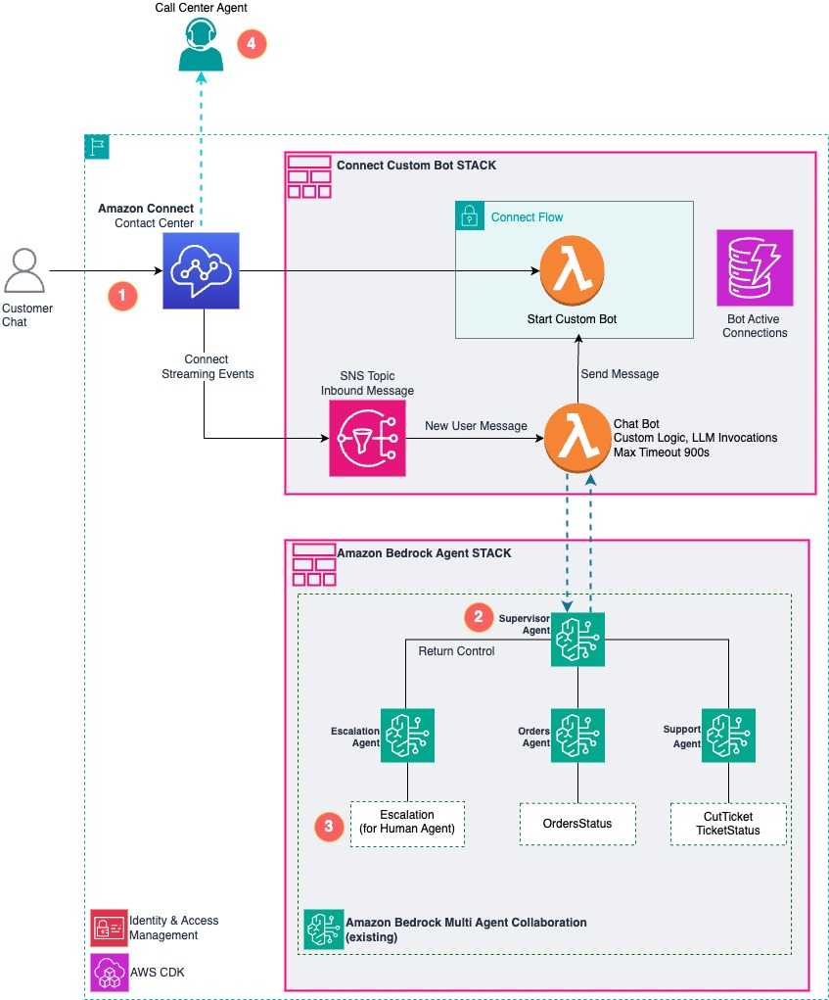
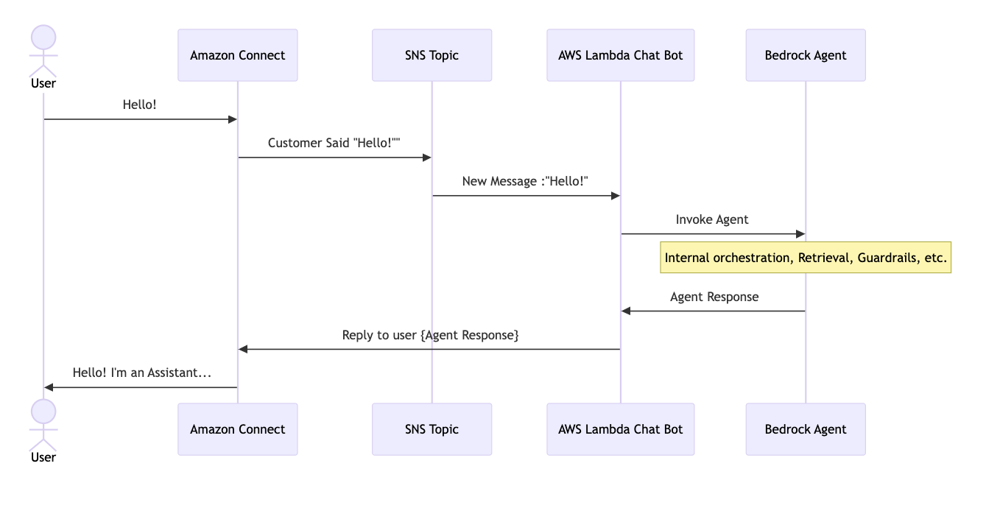
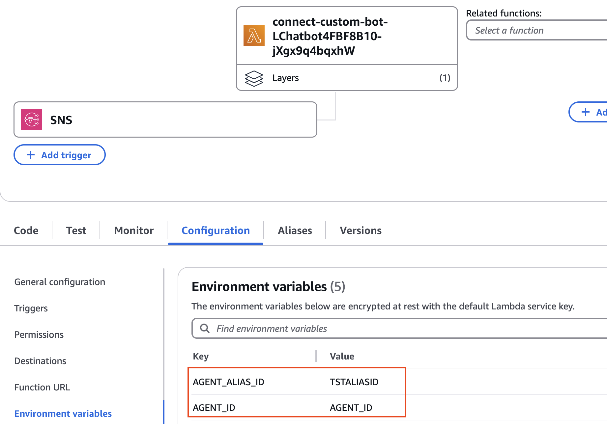
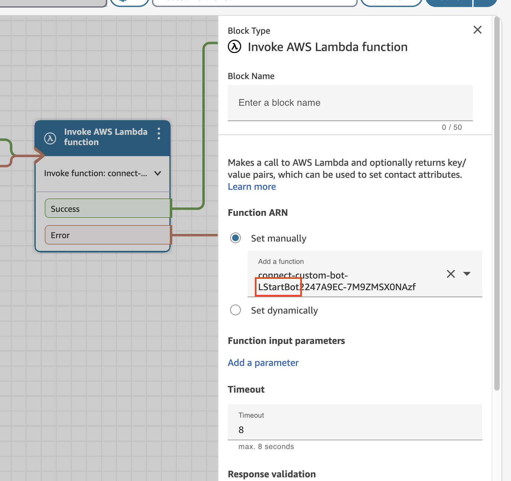
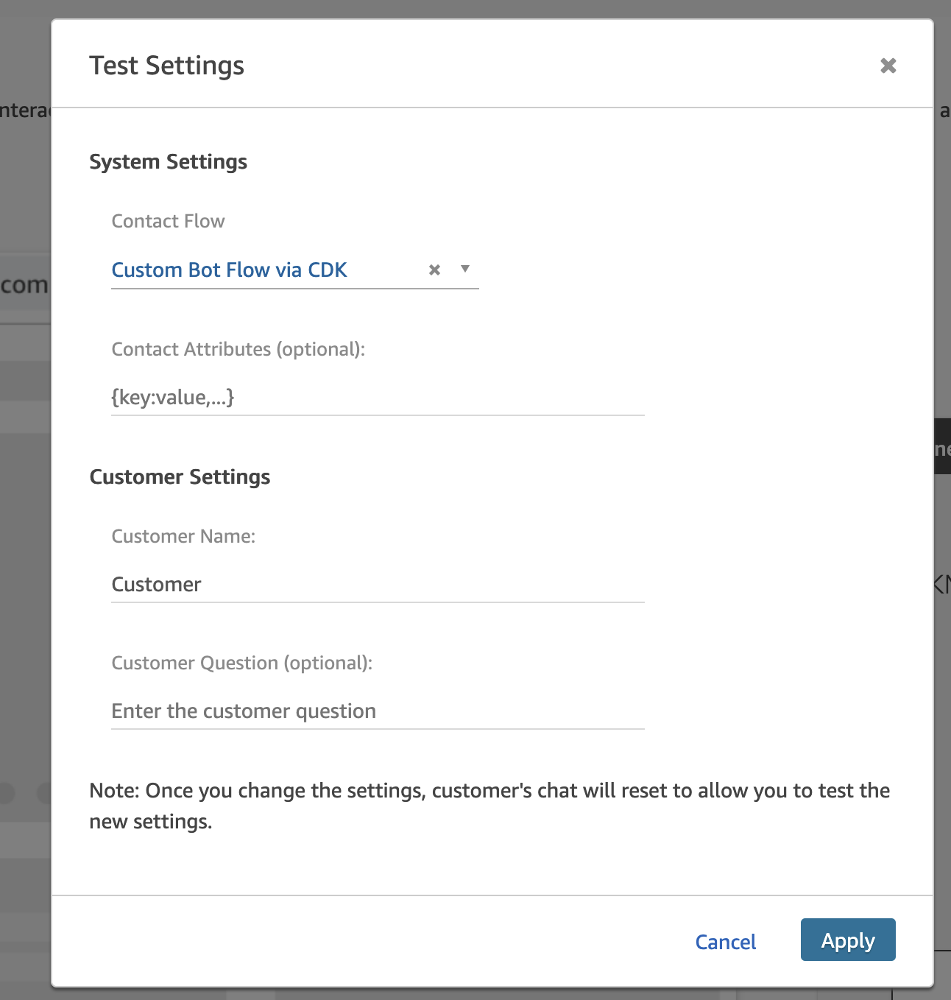
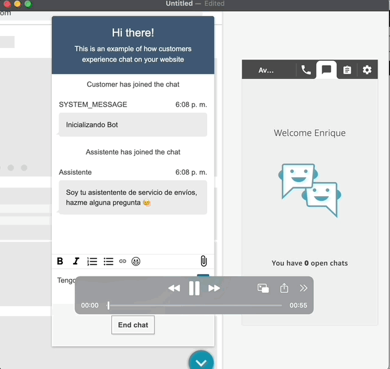

# Amazon Connect Custom Bot with Bedrock Multi Agent Collaboration and Human Escalation

## Table of Contents
- [Introduction](#introduction)
- [Architecture](#architecture)
  - [System Flow](#the-system-flow-is)
  - [Chatbot Sequence Diagram](#chatbot-sequence-diagram)
- [Deployment](#deployment)
  - [Prerequisites](#prerequisites)
    - [1) An Amazon Connect instance](#1-an-amazon-connect-instance)
    - [2) A Bedrock Agent](#2-a-bedrock-agent)
    - [3) CDK Setup](#3-cdk-setup)
  - [Deploy the Custom Bot Stack](#deploy-the-custom-bot-stack)
  - [Post deployment setup](#post-deployment-setup)
    - [AWS Lambda Environment Variables](#aws-lambda-environment-variables)
    - [Amazon Connect Flow](#amazon-connect-flow)
- [Testing](#testing)
- [Demo](#demo)
- [Security](#security)
- [Cost Considerations](#cost-considerations)
- [Decommissioning](#decommissioning)


## Introduction
While [Amazon Lex](https://docs.aws.amazon.com/connect/latest/adminguide/amazon-lex.html) could  be suitable for basic chatbot integration in Amazon Connect that offers native Amazon Q integration, which is ideal for companies without extensive generative AI expertise seeking quick deployment of AI-powered customer service capabilities (see [Amazon Q in Connect documentation](https://docs.aws.amazon.com/connect/latest/adminguide/generative-ai-powered-self-service-q.html)), some organizations require more flexibility and control over their AI capabilities, custom reasoning workflows, or sophisticated multi-agent architectures.

This project implements a custom chatbot solution for Amazon Connect that leverages Amazon Bedrock Agents, providing advanced capabilities for companies that need to:
- Execute long-running reasoning or multi-agent workflows
- Integrate with custom knowledge bases and Bedrock Agents
- Implement asynchronous bot interactions
- Build complex, customized conversation flows

The system is designed to provide AI responses and interactions,  while maintaining the ability to escalate to human agents when necessary, ensuring optimal customer service delivery.

## Architecture

The solution architecture consists of several key components:

**Amazon Connect Instance (existing)** for customer interaction management

**AWS Lambda functions, DynamoDB tables and SNS Topic** for chat processing and bot initialization.

**Amazon Bedrock Agent** ([this repo](https://github.com/aws-samples/generative-ai-ml-latam-samples/tree/main/samples/multi-agent-collaboration)) for AI-powered responses




### The system flow is:
1. **Customer** initiates chat in Connect
   - a Inside the contact flow **start Bot Lambda** initializes the session and store contact id 
   - b For every customer message **Chat Bot Lambda** process that message and responds.
2. **Bedrock Agent** is invoked, it could be a single agent or multi agent in a collaboration scheme.
3. **Escalation** is handled by specific Agent or Action Group. With **[RETURN CONTROL](https://docs.aws.amazon.com/bedrock/latest/userguide/agents-returncontrol.html)** the agent signal the application the specific action (escalation) and parameters needed for escalation (order_id, issue, ticket, or other defined)
4. **Amazon Connect** identifies the action and moves the contact to a human agent, to continue the interaction with the customer.


### Chatbot Sequence Diagram




For every turn the [ChatBot Lambda function](lambdas/code/chat_bot/lambda_function.py) parses the message content and invokes the Bedrock Agent. Then it sends the response back to the chat session.

```python
# Answer with Agent
...
response = bedrock_agent.invoke_agent(content)
print (f"Response: {response}")

if type(response) == str: 
   chat_service.send_message(response)
```

If the response is a dictionary, meaning `RETURN_CONTROL` type of response, that will be signaled to Amazon Connect using Contact Attributes:

```python
elif type(response) == dict:
   print("Updating Contact Attributes")
   chat_service.update_contact_attributes(attributes =response)
   chat_service.send_message( f"Action: {response.get('functionName')}")

   # Dummy response from fictional system invocation_result = OK
   return_control_response = bedrock_agent.return_control_invocation_results(
            invocation_id=response.get("invocationId"),
            action_group=response.get("actionGroup"),
            function_name=response.get("functionName"),
            invocation_result="OK",
            agent_id = response.get("agentId")
      )
   chat_service.disconnect()
   print(f"return_control_response: {return_control_response}")
```


## Deployment
### Prerequisites

#### 1) An Amazon Connect instance

You need a Amazon Connect Instance. If you don't have one already you can [follow this guide](https://docs.aws.amazon.com/connect/latest/adminguide/amazon-connect-instances.html).


#### 2) A Bedrock Agent

A Bedrock agent is needed and it's not deployed in this stack.If you dont have at least 1 working agent you can easily create one. Here are some options:

- [Multi-Agent Collaboration System with escalation using CDK](https://github.com/aws-samples/generative-ai-ml-latam-samples/tree/main/samples/multi-agent-collaboration). Recommended, this are the agents in the diagram and in the demo.
- [Create and configure agent manually](https://docs.aws.amazon.com/bedrock/latest/userguide/agents-create.html) (manually)
- [Amazon Bedrock Agent Samples](https://github.com/awslabs/amazon-bedrock-agent-samples) For mor examples and dive deep.

#### 3) CDK Setup

New to CDK? [Start here](https://docs.aws.amazon.com/cdk/v2/guide/getting_started.html) to learn how to:
- Install CDK and dependencies
- Configure your environment 
- Bootstrap your AWS account and region


### Deploy the Custom Bot Stack

Clone the repo:
```bash
git clone https://github.com/aws-samples/generative-ai-ml-latam-samples
```

Set up environment:
```bash
cd samples/connect-custom-bot
python3 -m venv .venv
source .venv/bin/activate  # On Windows use: .venv\Scripts\activate.bat
pip install -r requirements.txt
```

Deploy the stack:
```bash
cdk cdk deploy --parameters instanceId=<YOUR INSTANCE ID>
```
Replace **`<YOUR INSTANCE ID>`** with your [Amazon Connect Instance Id](https://docs.aws.amazon.com/connect/latest/adminguide/find-instance-arn.html)

### Post deployment setup

#### AWS Lambda Environment Variables

After deployed, go to the ChatBot Lambda function and update the `AGENT_ALIAS_ID` and `AGENT_ID` environment variables :




The `AGENT_ID` can be seen in bedrock agent console, and **TSTALIASID** is the default alias ID for the first agent (Draft version).

#### Amazon Connect Flow

If you passed a **instance_id** to the stack deployment, a contact flow called `Custom Bot Flow via CDK` will be created in that instance with CDK. 

If you want to do it manually,  download the [Flow Definition](amazon_connect/flow_definition.json) and [import that in your Amazon Connect Instance](https://docs.aws.amazon.com/connect/latest/adminguide/contact-flow-import-export.html). After importing, make sure you are invoking your `StartBot` Lambda function and using `BasicQueue` in `Set Working Queue` block.

|Invoke AWS Lambda function Block|Set working Queue Block|
|--|--|
||| 

Then **save and publish** the flow.


## Testing 

In order to test the chatbot, go to your Amazon Connect Instance and [Test Chat](https://docs.aws.amazon.com/connect/latest/adminguide/chat-testing.html#test-chat) using the newly created `Custom Bot Flow via CDK`



## Demo
Just interact with your chatbot, in this example we have a multi agent order support and escalation agent.




## Security

For information about securing your implementation, please refer to the [Amazon Bedrock Security documentation](https://docs.aws.amazon.com/bedrock/latest/userguide/security.html). This will help you configure Amazon Bedrock according to your security and compliance requirements.


## Cost Considerations

The main cost components for this project include:
- [Amazon Connect Chat](https://aws.amazon.com/es/connect/pricing/): 0,004 USD per message 
- [AWS Lambda](https://aws.amazon.com/lambda/pricing/): Likely covered by free tier for this demo (1 million free requests and 400,000 GB-seconds of compute time per month)
- [Amazon DynamoDB](https://aws.amazon.com/dynamodb/pricing/)
- [Amazon SNS](https://aws.amazon.com/sns/pricing/) (no charges for lambda delivery)

## Decommissioning

To remove all resources:
- Using CDK CLI: Run `cdk destroy`
- Using AWS Console: Navigate to CloudFormation and select "Delete"

Enjoy building!
