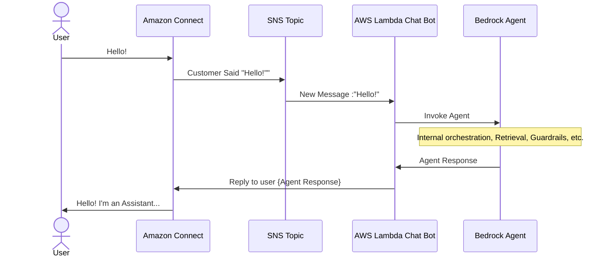

```mermaid
sequenceDiagram
Actor U as User
participant C as Amazon Connect
participant S as SNS Topic
participant L as AWS Lambda Chat Bot
participant A as Bedrock Agent

U->>C: Hello!
C->>S: Customer Said "Hello!""
S->>L: New Message :"Hello!"
L->>A: Invoke Agent
Note over A: Internal orchestration, Retrieval, Guardrails, etc.
A->>L: Agent Response
L->>C: Reply to user {Agent Response}
C->>U: Hello! I'm an Assistant...
```