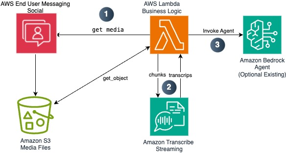
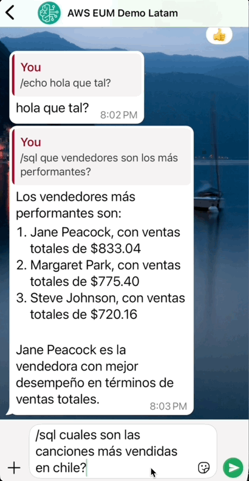

# WhatsApp Integration with AWS End User Messaging and Amazon Bedrock

<div style="background:rgba(91, 200, 255, 0.47);">
<table width="100%" >
<tr>
<td width="50%"><h3>📢 <strong>Feb/25 Update</strong>: 

Now understanding user voice notes. <a href="#bonus-understanding-voice-notes-with-amazon-transcribe-streaming">Got to the update</a></h3></td>
<td width="50%"></td>
</tr>
</table>
</div>

## Overview
This project demonstrates how to create a WhatsApp communication channel using AWS End User Messaging for social integration. The architecture is straightforward and allows you to optionally integrate your business logic with Amazon Bedrock Agents for AI-powered interactions.

## Architecture 

This architecture provides a scalable foundation for building WhatsApp-based applications with optional AI capabilities through Amazon Bedrock. 

### Flow 

1. User sends a message via WhatsApp Business
2. Message is routed to AWS End User Messaging Social service
3. Event is published to SNS topic and triggers Lambda function
4. Lambda executes business logic (e.g., saving messages, validation, responses) Optional: Integration with Bedrock Agent for AI capabilities
5. Response is sent back through AWS End User Messaging to WhatsApp (6)


## Prerequisites

To get started, businesses need to either create a new WhatsApp Business Account (WABA) or migrate an existing one to AWS. The main steps are described [here](https://docs.aws.amazon.com/social-messaging/latest/userguide/getting-started.html). In summary:


1. Have or create a Meta Business Account
2. Access AWS End User Messaging Social console and and link business account through Facebook embedded portal.
3. Ensure you have a phone number that can receive SMS/voice verification and add it to Whatsapp. 

### AWS Setup

Note: If you you don't know what CDK is, please [start here](https://docs.aws.amazon.com/cdk/v2/guide/getting_started.html) and install cdk and dependencies, configure environment and boostrap your account and region.


## Deployment
This project uses AWS CDK for infrastructure deployment. Follow these steps:

Clone the repo:
```bash
git clone https://github.com/aws-samples/generative-ai-ml-latam-samples
```


Set up environment:
```bash
cd samples/end-user-messaging-bedrock
python3 -m venv .venv
source .venv/bin/activate  # On Windows use: .venv\Scripts\activate.bat
pip install -r requirements.txt
```

Deploy the stack:
```bash
cdk deploy
```
⚠️ Important: Deploy in the same region as your AWS End User Messaging configuration


## Post-deployment setup

### Add the event destination 

After deploying the stack, use the created SNS topic as your event destination in AWS End user messaging social console. The specific arn will be in the cloudformation output (or cdk deploy output).

cloudformation stack outputs:


AWS End user messaging social console:


## Business Logic Implementation

The SNS topics basically invokes AWS Lambda with a list of records that follow [this structure](https://docs.aws.amazon.com/social-messaging/latest/userguide/managing-event-destination-dlrs.html). After parsing each record there is a provided `WhatsappService` class to easily save, react, read, and reply whatsapp messages:

[lambda_function.py](lambdas/code/whatsapp_event_handler/lambda_function.py)
```python
for message in whatsapp.messages:
    ...
    message.save(table)
    message.mark_as_read()
    message.reaction("👍")
    ...
    text = message.get_text()
    if text.startswith("/echo "):            
        message.text_reply(text.replace("/echo ", ""))
```

From here, just follow Meta's messages structure and invoke [`send_whatsapp_message`](https://boto3.amazonaws.com/v1/documentation/api/latest/reference/services/socialmessaging/client/send_whatsapp_message.html) method from End User Social Service. For a complete list of the different messages you can send and examples, please refer to [this documentation](https://developers.facebook.com/docs/whatsapp/cloud-api/messages/text-messages). 

There is a boilerplate python code in [whatsapp.py](lambdas/code/whatsapp_event_handler/whatsapp.py) that provides the following examples:

### Mark message as read

```python
def mark_as_read(self):
    message_object = {
        "messaging_product": "whatsapp",
        "message_id": self.message_id,
        "status": "read",
    }
    kwargs = dict(
        originationPhoneNumberId=self.phone_number_arn, 
        metaApiVersion=self.meta_api_version,
        message=bytes(json.dumps(message_object), "utf-8")
    )
    response = self.client.send_whatsapp_message(**kwargs)
```

### React to user message

```python

def reaction(self, emoji):
    message_object = {
        "messaging_product": "whatsapp",
        "recipient_type": "individual",
        "to": f"+{self.phone_number}",
        "type": "reaction",
        "reaction": {"message_id": self.message_id, "emoji": emoji}
    }
    kwargs = dict(
        originationPhoneNumberId=self.phone_number_arn,
        metaApiVersion=self.meta_api_version,
        message=bytes(json.dumps(message_object), "utf-8"),
    )
    response = self.client.send_whatsapp_message(**kwargs)
```


### Reply to user 

```python
def text_reply(self, text_message):
    print("reply message...")
    message_object = {
        "messaging_product": "whatsapp",
        "recipient_type": "individual",
        "context": {"message_id": self.message_id},
        "to": f"+{self.phone_number}",
        "type": "text",
        "text": {"preview_url": False, "body": text_message},
    }

    kwargs = dict(
        originationPhoneNumberId=self.phone_number_id,
        metaApiVersion=self.meta_api_version,
        message=bytes(json.dumps(message_object), "utf-8"),
    )

    response = self.client.send_whatsapp_message(**kwargs)
```


### Download a media file to s3

```python
def download_media(self, media_id, phone_id, bucket_name, media_prefix):

    media_content = self.client.get_whatsapp_message_media(
        mediaId=media_id,
        originationPhoneNumberId=phone_id,
        destinationS3File={"bucketName": bucket_name, "key": media_prefix},
    )

    extension = media_content.get("mimeType","").split("/")[-1]
    
    return dict(
        **media_content, 
        location=f"s3://{bucket_name}/{media_prefix}{media_id}.{extension}"
    )
```

[Official Docs](https://docs.aws.amazon.com/social-messaging/latest/userguide/receive-message-image.html)

### Bonus: understanding voice notes with Amazon Transcribe Streaming

Besides text, [messages can contain media](https://developers.facebook.com/docs/whatsapp/cloud-api/reference/messages?locale=es_LA) (audio, images, etc). To leverage that audio it need to be downloaded and transcribed first. Code details in [transcribe.py](lambdas/code/whatsapp_event_handler/transcribe.py)

#### Sequence

1. Get Media from Meta to S3 bucket using `get_whatsapp_message_media`. Use `get_object` api call to read the file directly from S3 location.
2. For short audios, instead of transcription jobs, Transcribe Streaming is preferred to get a transcription in realtime. For longer audios transcribe jobs is better option.
3. After transcription is complete, we use that to save the message and invoke the Agent.


<p align="center">
  
</p>


### Saving Messages for long conversations

Although is not needed in this demo, we implemented a way to persist messages in a DynamoDB table for future use. For example you can refer to past messages to provide more context to your conversation. We save the message as well the metadata from whatsapp event.

```python
def save(self,table):
    print("saving message...")
    table.put_item(Item=dict(**self.message, **self.metadata))
```


## Integration with Amazon Bedrock Agent


### What is an Amazon Brodrock Agent?

[Amazon Bedrock Agents](https://docs.aws.amazon.com/bedrock/latest/userguide/agents.html) are managed autonomous agents that orchestrate interactions between foundation models, data sources, and APIs to complete user tasks through natural conversation. They automatically handle prompt engineering, memory, monitoring, and API invocations without requiring infrastructure management. If you want to deploy the same agent that we used here, please [follow this](https://github.com/aws-samples/generative-ai-ml-latam-samples/blob/main/pocs/sql-bedrock-agent).

You can enhance your WhatsApp Service with AI capabilities using Amazon Bedrock Agents. Assuming there is one created and ready. For this you just need to provide AGENT_ID, AGENT_ALIAS_ID in  [end_user_messaging_bedrock_stack](./end_user_messaging_bedrock/end_user_messaging_bedrock_stack.py)

```python
AGENT_ID = "YOURAGENTID"
AGENT_ALIAS_ID = "TSTALIASID"
```


Optionally you can change this Agent without redeploy by changing [AWS Lambda environment variables](https://docs.aws.amazon.com/lambda/latest/dg/configuration-envvars.html).
We implemented a SQL Agent which can answer natural language questions from databases, here is the flexibility because you can use yours just by changing AGENT_ID / AGENT_ALIAS_ID. If you want to explore more About Agents for Amazon Bedrock, [start here](https://aws.amazon.com/bedrock/agents/)

Some ideas you can explore are:

- A support agent that can answer with facts in Knowledge Base, and open support tickets.
- A sales agent that can provide product information and open CRM Oportunities for new prospects.

Agents for Bedrock handles the conversation memory as part of the service (no need for databases). Hence, we use the `phone_number` as `session_id` so we can follow up questions to this agent until session times out. Also we pass `/sql` as some sort of command from whatsapp to make sure we want to use this agent to handle the query (it's not necessary, but practical).

[lambda_function.py](lambdas/code/whatsapp_event_handler/lambda_function.py)
```python
if text.startswith("/sql "):
    user_query = text.replace("/sql ", "")
    print(f"query: {user_query}")
    response = sql_agent.invoke_agent(message.phone_number, user_query)
    print(f"agent response: {response}")
    message.text_reply(response)
```
[bedrock_agent.py](lambdas/code/whatsapp_event_handler/bedrock_agent.py)
```python
def invoke_agent(self, session_id, prompt):
    try:
        response = self.agents_runtime_client.invoke_agent(
            agentId=self.agent_id,
            agentAliasId=self.alias_id,
            sessionId=session_id,
            inputText=prompt,
        )
        completion = ""
        for event in response.get("completion"):
            chunk = event["chunk"]
            completion = completion + chunk["bytes"].decode()
    except ClientError as e:
        logger.error(f"Couldn't invoke agent. {e}")
        raise

    return completion
```

## Test your Aplication

You can now send whatsapp messages to your number and see the results:


| **demo** | **demo with voice** |
|----------|-------------------|
|  |  |


## Cost Considerations
The main cost components for this solution are:
1. [AWS End User Messaging](https://aws.amazon.com/end-user-messaging/pricing/)
    - Pay per message sent/received 0.005 USD
   - Conversation rate (24 thread) depends of conversartion categories.
   - [AWS Lambda](https://aws.amazon.com/lambda/pricing/)
   - [Amazon SNS](https://aws.amazon.com/sns/pricing/) (no charges for lambda delivery)
2. Optional costs:
   - [Amazon Bedrock](https://aws.amazon.com/bedrock/pricing)
   - [Amazon DynamoDB](https://aws.amazon.com/dynamodb/pricing/)
   - [Amazon Transcribe](https://aws.amazon.com/es/transcribe/pricing/)

All serverless and pay as you go (no cost if no used)

For detailed pricing, refer to [AWS End User Messaging pricing](https://aws.amazon.com/end-user-messaging/pricing/).

## Decomission

In order to delete resources, ust `cdk destroy` if using cdk cli. Alternately go to cloudformation console an hit `Delete`

Enjoy!
