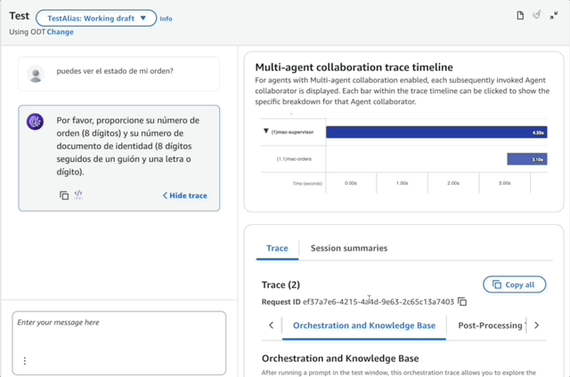
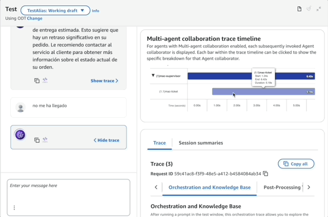

# Multi-Agent Collaboration System with escalation using CDK

## Table of Contents
- [Introduction](#introduction)
- [Architecture](#architecture-multi-agent-customer-support-with-escalation)
- [Prerequisites](#prerequisites)
  - [CDK Setup](#cdk-setup)
  - [Cross Region Inference](#cross-region-inference)
  - [Model Access](#model-access)
- [Deployment](#deployment)
- [Agent Definition](#agent-definition)
  - [Action Groups](#action-groups)
- [Adding Collaborators](#adding-collaborators)
- [Testing the Agent](#testing-the-agent)
  - [Testing Escalation](#testing-the-escalation-return-control-flow)
- [Security](#security)
- [Cost Considerations](#cost-considerations)
- [Decommission](#decomission)

## Introduction

Building effective agent-based systems and multi-agent collaboration systems presents several challenges in today's rapidly evolving AI landscape. These include coordinating and communicating between multiple specialized agents, maintaining context and consistency between them, and scaling the system for increasing requests.

The [Multi-Agent Collaboration](https://docs.aws.amazon.com/bedrock/latest/userguide/agents-multi-agent-collaboration.html) capability in Amazon Bedrock addresses these challenges by providing featurs for creating and managing multi-agent systems. Key benefits include simplified agent creation and management, built-in support for inter-agent collaboration, integration with other AWS services through AWS Lambda, and removal of undifferentiated heavy-lifting for infrastructure, model, prompt and framework management.

Using Infrastructure as Code (IaC) with [AWS CDK](https://docs.aws.amazon.com/cdk/v2/guide/getting_started.html) lets us quickly deploy and update AWS Infrastructure, track changes, and deploy consistently across environments. Currently there are no formal CDK constructs for Multi-Agent collaboration; to build one you have to use AWS Console or AWS SDK.

## Introduction

Building effective agent-based systems and multi-agent collaboration systems presents several challenges in today's rapidly evolving AI landscape. These include coordinating and communicating between multiple specialized agents, maintaining context and consistency between them, and scaling the system for increasing requests.

The [Multi-Agent Collaboration](https://docs.aws.amazon.com/bedrock/latest/userguide/agents-multi-agent-collaboration.html) capability in Amazon Bedrock addresses these challenges by providing features for creating and managing multi-agent systems. Key benefits include simplified agent creation and management, built-in support for inter-agent collaboration, integration with other AWS services through AWS Lambda, and removal of undifferentiated heavy-lifting for infrastructure, model, prompt and framework management.

Using Infrastructure as Code (IaC) with [AWS CDK](https://docs.aws.amazon.com/cdk/v2/guide/getting_started.html) lets us quickly deploy and update AWS Infrastructure, track changes, and deploy consistently across environments. Currently there are no formal CDK constructs for Multi-Agent collaboration; to build one you have to use AWS Console or AWS SDK.


This project demonstrates the power of combining Multi-Agent Collaboration in Amazon Bedrock with AWS CDK custom constructs to create a flexible, scalable, and easily maintainable customer support and order management system.

## Architecture: Multi-Agent Customer Support with Escalation


The sample Multi-Agent Collaboration System is designed to streamline customer support and order management processes using Amazon Bedrock Agents. It leverages Amazon Bedrock to create and manage multiple specialized agents that can collaborate to provide comprehensive assistance to customers.


The system includes the following key components:

- **Supervisor Agent**: Acts as the primary point of contact, managing overall customer interactions. Based on customer needs, it routes to specialized agents:
   - **Support Agent**: Handles creation and management of customer support tickets
   - **Orders Agent**: Provides customer order information and status
   - **Escalation Agent**: Manages escalation of complex issues to human specialists using the `RETURN CONTROL` capability ([detailed below](#about-return-control))

These agents collaborate to deliver a seamless customer experience - from answering order status inquiries to creating support tickets and escalating issues when needed. The system leverages AWS CDK (Cloud Development Kit) and integrates with AWS services like DynamoDB for data storage and Lambda for action execution.

## Prerequisites 

### CDK Setup

New to CDK? [Start here](https://docs.aws.amazon.com/cdk/v2/guide/getting_started.html) to learn how to:
- Install CDK and dependencies
- Configure your environment 
- Bootstrap your AWS account and region

Clone the repo:
```bash
git clone https://github.com/aws-samples/generative-ai-ml-latam-samples
```

Set up environment:
```bash
cd samples/multi-agent-collaboration
python3 -m venv .venv
source .venv/bin/activate  # On Windows use: .venv\Scripts\activate.bat
pip install -r requirements.txt
```

Deploy the stack:
```bash
cdk deploy
```

It takes about 5 minutes to deploy. While we wait, let's review the code.


## Agent Definition

The [multi_agent_collaboration_stack.py](./multi_agent_collaboration/multi_agent_collaboration_stack.py) file defines 4 agents:
- Supervisor agent
- Orders agent  
- Support ticket agent
- Escalations agent

Here's an example of how the support agent is defined:
```python
   ...
   def _create_agents(self) -> None:

      support_action_groups = ActionGroup().from_file(
         "agent_action_group_support_data.json", self.functions.tickets
      )

      # Create support agent
      self.support_agent = Agent(
         self,
         "SupportAgent",
         action_groups=support_action_groups,
         agent_name="mac-ticket",
         agent_description="Ticket Support",
         agent_instruction=(
               "Usted es un amable agente de soporte a cliente que ayuda creando tickets y entregando informacion de tickets de atencion de postventa."
         ),
         foundation_model=DEFAULT_MODEL_ID,
      )
      self.support_agent.create_alias("mac-ticket-alias")
      ...
```

For each Agent, you can configure the following properties:
- agent_name: Unique identifier for the agent
- agent_description: Brief description of the agent's purpose
- agent_instruction: Detailed instructions for the agent's behavior
- foundation_model: The underlying model ID to use
- action_groups: The set of actions the agent can perform

### Action Groups


Action groups define the capabilities of an agent in Amazon Bedrock by specifying what operations it can perform. To configure an agent's capabilities:
1. Modify the corresponding agent_action_group_xxx_data.json files
2. Each file defines the actions available to that specific agent

Here's an example showing how the Orders Agent action group is structured:

```json
[
    {
        "action_group_name": "OrdersActionGroup",
        "description": "Order status",
        "lambda_": "",
        "functions": [
            {
                "name": "getOrderStatus",
                "description": "Use this when you need to get the customer's order information",
                "parameters": [
                    {
                        "name": "order_number",
                        "type": "string",
                        "description": "8-digit order number. For example 12345678",
                        "required": 1
                    },
                    ...
                ]
            }
        ]
    }
    ...
]
```

You can change the AWS Lambda function in 

```python
ActionGroup().from_file("file.json", lambda_function)
```

or modify lambda code in [lambdas/code ](./lambdas/code/) folder. 

## Adding Collaborators

In order to create the collaboration, first enable collaboration for the `supervisor_agent`

```python
   self.supervisor_agent.enable_collaboration(how="SUPERVISOR_ROUTER") # SUPERVISOR / SUPERVISOR_ROUTER / DISABLED
```

Then you can add collaborators, indicating name and description (description will be used to decide which agent to route) for example for `support_agent`:

```python
self.supervisor_agent.add_collaborator(
   self.support_agent.alias,
   "support-tickets",
   "Use this agent when you need to create a customer support ticket or get ticket status, use this before escalation.  \
   You can only create tickets and inform status. ",
)
...
```


## Testing the Agent

You can use evaluations tools like [AgentEval](https://awslabs.github.io/agent-evaluation/) to asses if the agent is responding correctly ([results here](agenteval_summary.md)). For manual test we can use Amazon Bedrock Agents Console.

Note: Synthetic data can be found in `orders table`:

| order_number | delivery_date | first_name | identity_document_number | last_name | phone_number | shipping_address | status |
|-------------|---------------|------------|------------------------|-----------|--------------|-----------------|---------|
| 10026657 | 2024-08-06 | Carlos | 44444444-4 | Fernandez | 56977766888 | Calle las acacias 123, Providencia. Region Metropolitana | Pendiente Bodega |
| 10026656 | 2024-08-06 | Enrique | 10192797-1 | Gonzalez | 56912345678 | Calle las acacias 123, Providencia. Region Metropolitana | Despacho Programado |


**Conversation for problem with order**
```
[USER] I'm having a problem with order 10026656.
[AGENT] Could you please provide me with your identity document number? This is typically an 8-digit number followed by a dash and a letter (K or a digit), which is needed to look up your order status.
[USER] 10192797-1
[AGENT] I've found the details for your order 10026656:
- Status: Scheduled for Shipping (Despacho Programado)
- Delivery Date: August 6, 2024
- Shipping Address: Calle las acacias 123, Providencia, Metropolitan Region

Is there anything specific about the order you're having a problem with?
[USER] I'd like to create a ticket for support since the order has not been delivered yet.
[AGENT] I've created a support ticket for your order. 
- Ticket Number: 202502101332
- Order Number: 10026656
- Current Status: Open

Our support team will investigate the delivery issue and contact you soon. Is there anything else I can help you with today?
[USER] What is the status of ticket 202502101332?
[AGENT] The status of ticket 202502101332 is currently "open". 
- Order Number: 10026656
- Issue Details: Customer reports order has not been delivered as expected
- Our support team is investigating the shipping status and will work on resolving the delivery issue.
```

### Testing the Escalation Return Control Flow

To enable human interaction when needed, we implemented the **Escalation Agent**. This agent detects situations requiring escalation and gathers relevant information (defined in [agent_action_group_escalation_data](agent_action_group_escalation_data)). Let's test this functionality in the console:

**Part 1: Getting Order Information and Creating a Ticket**



**Part 2: Escalation Process**

##### About `RETURN CONTROL`

During testing, you'll see a prompt for **Escalation Action Group Output**. This is meant to simulate the result of escalation handling by company systems - it's not intended for end users to respond to. This prompt exists in the testing console solely to provide operation results back to the agent.




## Security

For information about securing your implementation, please refer to the [Amazon Bedrock Security documentation](https://docs.aws.amazon.com/bedrock/latest/userguide/security.html). This will help you configure Amazon Bedrock according to your security and compliance requirements.


## Cost Considerations

The main cost components for this project include:
- [Amazon Bedrock](https://aws.amazon.com/bedrock/pricing): Charges only for input/output tokens when using Haiku 3.5 (with default inference profile). No additional charges for Bedrock Agents.
- [AWS Lambda](https://aws.amazon.com/lambda/pricing/): Likely covered by free tier for this demo (1 million free requests and 400,000 GB-seconds of compute time per month)
- [Amazon DynamoDB](https://aws.amazon.com/dynamodb/pricing/)

This solution uses serverless architecture with pay-as-you-go pricing (zero cost when not in use).

## Decommissioning

To remove all resources:
- Using CDK CLI: Run `cdk destroy`
- Using AWS Console: Navigate to CloudFormation and select "Delete"

Enjoy building!
