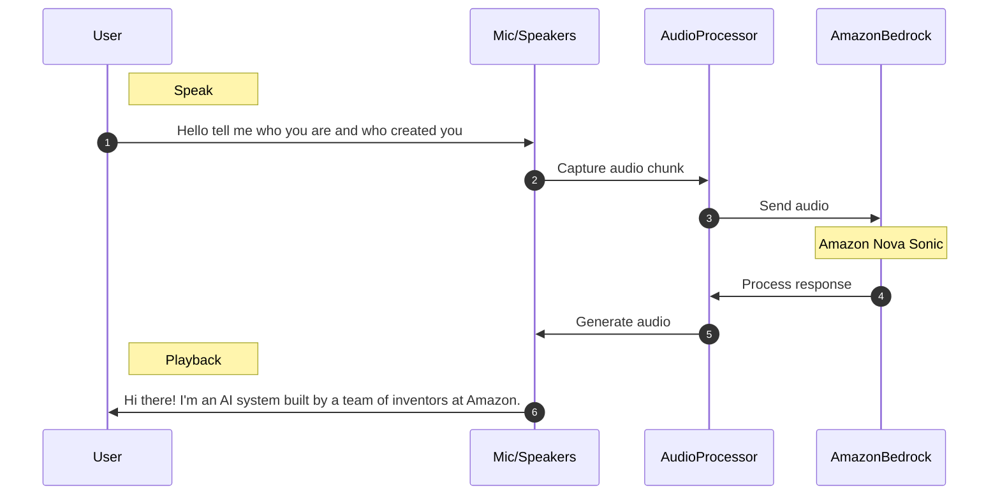

# Nova Sonic Sample

This project demonstrates how to use Amazon Bedrock's Nova Sonic model for audio processing with bidirectional streaming.




## Prerequisites

- Python 3.11+
- AWS credentials configured 
- Required Python packages (see requirements.txt)
- Optional [portaudio](https://www.portaudio.com/)

## Installation

1. Create a python virtual environment and activate:

   ```
   python3 -m venv .venv
   source .venv/bin/activate  # On Windows use: .venv\Scripts\activate.bat
   ```

1. Install PortAudio if not installed (required for PyAudio):
   ```
   brew install portaudio
   ```

2. Install Python dependencies:
   ```
   pip install -r requirements.txt
   ```

## Usage

Run the following command to see the Nova Sonic model in action:
```
python3 demo.nova.sonic.py
```

The demo will start capturing audio from your microphone and processing it through the Nova Sonic model. Press Enter to stop the demo.

## Live Demo

<video src="demo.mp4" width="320" height="400" controls></video>


## Notes

This sample demonstrates bidirectional streaming with Amazon Bedrock's Nova Sonic model, allowing for real-time audio processing.

