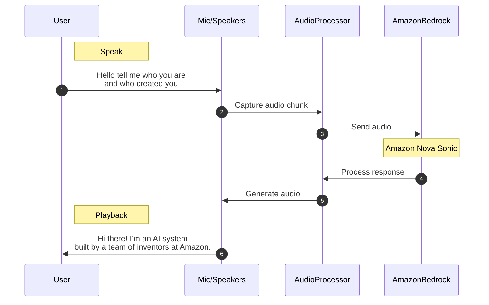

# Nova Sonic Sample

This project demonstrates how to use Amazon Bedrock's Nova Sonic model, a groundbreaking speech and voice foundation model developed by Amazon. Nova Sonic represents a significant advancement in conversational AI technology, capable of processing and generating human-like speech in real-time through bidirectional streaming.

## About Nova Sonic

Nova Sonic is Amazon's state-of-the-art speech foundation model that powers various voice experiences. As announced by Amazon ([read more](https://www.aboutamazon.com/news/innovation-at-amazon/nova-sonic-voice-speech-foundation-model)), it's designed to enable more natural and engaging voice interactions. The model excels at:

- Real-time speech processing and generation
- Natural-sounding voice responses
- Bidirectional streaming capabilities
- High-quality voice synthesis

This implementation is based on the [AWS Nova bidirectional streaming documentation](https://docs.aws.amazon.com/nova/latest/userguide/speech-bidirection.html), showcasing how to create interactive voice applications using Nova Sonic's streaming capabilities.




## Prerequisites

- Python 3.11+
- AWS credentials configured 
- Required Python packages (see requirements.txt)
- Optional [portaudio](https://www.portaudio.com/)

## Supported Voices

Currently, Nova Sonic supports English voices with both American and British accents. For a complete and up-to-date list of available voices, please refer to the [AWS Nova Available Voices documentation](https://docs.aws.amazon.com/nova/latest/userguide/available-voices.html).

Languages:
- English (including American and British accents)
- Additional languages coming soon

## Installation

1. Create a python virtual environment and activate:

   ```
   python3 -m venv .venv
   source .venv/bin/activate  # On Windows use: .venv\Scripts\activate.bat
   ```

1. Install PortAudio if not installed (required for PyAudio):
   ```
   brew install portaudio
   ```

2. Install Python dependencies:
   ```
   pip install -r requirements.txt
   ```

## Usage

Run the following command to see the Nova Sonic model in action:
```
python3 demo.nova.sonic.py
```

You can select a specific voice by using the `--voice-id` parameter:
```
python3 demo.nova.sonic.py --voice-id amy|tiffany|matthew
```

The demo will start capturing audio from your microphone and processing it through the Nova Sonic model using the selected voice (defaults to 'matthew' if not specified). Press Enter to stop the demo.

## Live Demo

<video src="https://github.com/user-attachments/assets/947add71-b348-41dc-80bc-e239a676c3ff" width="320" height="400" controls></video>

[Demo direct link](demo.mp4)


