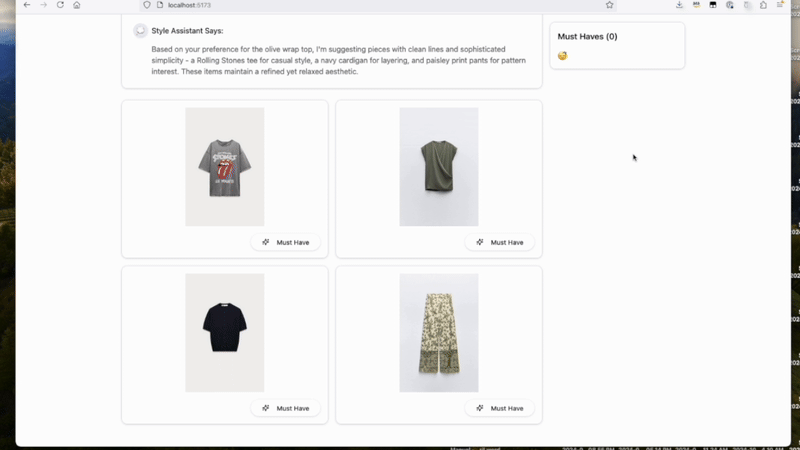

# WardrobeAI Demo

An AI-powered fashion recommendation system that demonstrates the integration of AWS Bedrock and Anthropic Claude for personalized style suggestions.




## Overview

This demo showcases:
- Real-time fashion recommendations using multiple AI models
- Image-based clothing analysis
- Interactive shopping experience
- User preference learning
- AWS Bedrock and Claude integration

## Architecture


- **Frontend**: React + TypeScript + Vite
- **Backend**: Node.js + TypeScript microservices
- **AI Services**: AWS Bedrock + Anthropic Claude

## Quick Start

### Prerequisites

- Node.js 18+
- AWS Account with Bedrock access
- Anthropic API key
- AWS CLI configured

### Installation

1. Clone the repository:
```bash
git clone https://github.com/aws-samples/generative-ai-ml-latam-samples.git
cd samples/wardrobe-ai
```

2. Set up environment variables:
```bash
# Backend (.env)
ANTHROPIC_API_KEY=your_anthropic_api_key
AWS_REGION=your_aws_region
```

3. Install dependencies and start:
```bash
# Backend
cd packages/backend
npm install
npm run dev

# Frontend
cd packages/frontend
npm install
npm run dev
```

4. Add clothing images:
```bash
mkdir -p packages/backend/public/pictures
# Add your .jpeg images to the pictures directory
```

## Features

- 👕 AI-powered style analysis
- 🛍️ Personalized recommendations
- 🎯 Preference tracking
- 🛒 Shopping cart integration
- 🖼️ Image-based suggestions

## API Endpoints

```http
GET /api/startchat            # Initialize chat session
POST /api/bestItemHandler     # Handle favorite item selection
POST /api/chatResponseHandler # Process shopping cart updates
```

## Project Structure

```
wardrobe-ai/
├── packages/
│   ├── frontend/          # React frontend
│   │   ├── src/
│   │   └── public/
│   └── backend/           # Node.js backend
│       ├── src/
│       │   └── microservices/
│       │       └── chatbot/
│       └── public/
│           └── pictures/  # Clothing images
```

## Development

### Backend

```typescript
// Add new endpoint
@RequestHandler<HttpRequest>("METHOD:/path")
public async newHandler(request: HttpRequest): Promise<HttpResponse> {
    // Implementation
}
```

### Frontend

```bash
cd packages/frontend
npm run dev
```

## Configuration

### AWS Setup

1. Configure AWS CLI:
```bash
aws configure
```

2. Enable Bedrock access in your AWS account

### Environment Variables

```env
ANTHROPIC_API_KEY=required
AWS_REGION=required
PORT=8082
```

## Documentation

- [Technical Documentation](docs/technical.md)
- [API Documentation](docs/api.md)
- [Development Guide](docs/development.md)

## Security

See [CONTRIBUTING](../CONTRIBUTING.md#security-issue-notifications) for security notification procedures.

## License

This project is licensed under the MIT-0 License. See the [LICENSE](LICENSE) file.

## Contributing

See the [Contributing Guide](../CONTRIBUTING.md).

---

## Related Resources

- [AWS Bedrock Documentation](https://docs.aws.amazon.com/bedrock)
- [Anthropic Claude Documentation](https://docs.anthropic.com)
- [React Documentation](https://react.dev)
